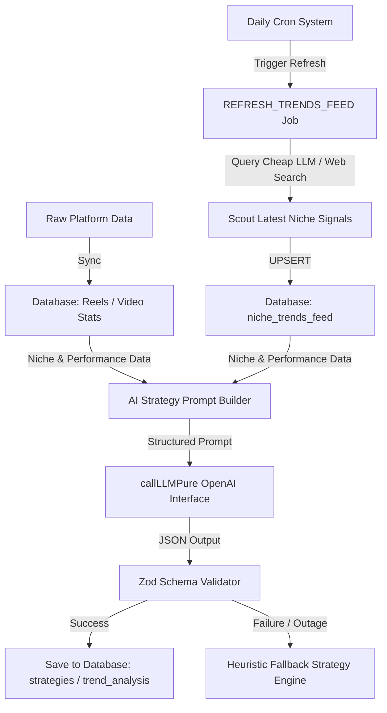

# Trendoraa AI Trend Analysis & Niche Strategy System

This document outlines the architecture, data structures, and prompt schemas for the **AI Trend Analysis & Niche Strategy System**. This engine powers Trendoraa's competitive differentiator: generating dynamic video content strategies by cross-referencing a creator's raw performance history (e.g., skip rates, watch-through rates) with platform-wide viral trends and topic velocities.

---

## 🗺️ Ingestion & Strategy Generation Pipeline

To maintain near-$0 overhead and absolute uptime, Trendoraa separates external trend crawling from individual creator requests by utilizing a **Cached Niche Trends Feed Indexer**. A single daily cron job fetches and aggregates platform-wide viral trends per niche, caching them in the database. When a creator triggers a trend analysis, the system instantly fetches the cached niche trends, avoiding redundant scraper calls.



---

## 📝 The `TRENDS_ANALYSIS_PROMPT`

Below is the production-ready prompt template utilized by `lib/ai/prompts/trends.ts` to analyze high-growth trends mapped directly to a creator's niche:

```typescript
export const TRENDS_ANALYSIS_PROMPT = `
You are a master social media algorithms engineer and viral growth strategist. Your task is to analyze raw platform trend data (audios, hashtags, topics) and cross-reference them with a specific creator's performance history and niche parameters to generate actionable content hooks and strategic alignment scores.

## 1. Creator Profile
- Handle: @{username}
- Niche: {niche} (e.g., tech, comedy, finance, education, lifestyle, fashion)
- Primary Goal: {goal} (e.g., audience retention, engagement, follower growth)
- Historical Performance:
  - Avg engagement rate: {avg_engagement_rate}%
  - Avg skip rate (Instagram): {avg_skip_rate}%
  - Avg completion rate (TikTok): {avg_completion_rate}%

## 2. Ingested Trend Signals (Last 24 Hours)
{ingested_trend_signals}

## 3. Creator's Recent Content History
{recent_content_history}

## 4. Instructions
Analyze the raw trend signals through the strict lens of the creator's specific {niche} content. Map out exactly:
- **Niche Trend Score:** How well current platform-wide trends align with their topic authority (1-100).
- **Viral Sound Alignment:** Identify which high-velocity audio formats can be adapted to their format.
- **Hook Mutations:** Take 3 high-velocity platform hooks and mutate them specifically to fit the creator's niche and goal.
- **Actionable Content Blueprints:** Draft 3 quick-execution Reel/TikTok ideas utilizing these trends.

Return ONLY a valid JSON payload matching this Zod-enforceable schema:
{
  "niche_trend_score": <number 1-100>,
  "trend_verdict": "<1-2 sentence high-level trend summary>",
  "trend_pillars": [
    {
      "trend_name": "<string>",
      "velocity": "high|surging|stable",
      "niche_relevance": "<string explaining how this niche can utilize it>"
    }
  ],
  "sound_recommendations": [
    {
      "audio_name": "<string>",
      "original_link": "<string>",
      "usage_type": "background_music|voiceover_underlay|pattern_interrupt",
      "editing_instruction": "<specific editing instruction like 'cut on beat 4' or 'fade at 3s'>"
    }
  ],
  "hook_mutations": [
    {
      "original_trend_hook": "<string describing the viral platform hook>",
      "mutated_niche_hook": "<the exact 3-second text overlay/spoken line for this creator>",
      "psychological_trigger": "<why this mutated hook lowers skip rate or drives saves>"
    }
  ],
  "actionable_blueprints": [
    {
      "title": "<string>",
      "format": "fast_reel|talking_head|aesthetic_broll|split_screen",
      "topic": "<specific topic tailored to niche>",
      "visual_directions": "<brief editing/shooting instructions>",
      "suggested_duration_seconds": <number>
    }
  ]
}
`;
```

---

## 🛡️ Output Validation Schema (Zod)

Every trend analysis response must be strictly validated before entering the database. The validation schema is defined as:

```typescript
import { z } from "zod";

export const TrendAnalysisOutputSchema = z.object({
  niche_trend_score: z.number().int().min(1).max(100),
  trend_verdict: z.string().min(10).max(200),
  trend_pillars: z.array(
    z.object({
      trend_name: z.string().min(2),
      velocity: z.enum(["high", "surging", "stable"]),
      niche_relevance: z.string().min(10),
    })
  ).min(1),
  sound_recommendations: z.array(
    z.object({
      audio_name: z.string(),
      original_link: z.string().url().optional().or(z.literal("")),
      usage_type: z.enum(["background_music", "voiceover_underlay", "pattern_interrupt"]),
      editing_instruction: z.string().min(10),
    })
  ),
  hook_mutations: z.array(
    z.object({
      original_trend_hook: z.string().min(5),
      mutated_niche_hook: z.string().min(5),
      psychological_trigger: z.string().min(10),
    })
  ).min(1),
  actionable_blueprints: z.array(
    z.object({
      title: z.string().min(5),
      format: z.enum(["fast_reel", "talking_head", "aesthetic_broll", "split_screen"]),
      topic: z.string().min(5),
      visual_directions: z.string().min(10),
      suggested_duration_seconds: z.number().int().positive(),
    })
  ).min(1),
});

export type TrendAnalysisOutput = z.infer<typeof TrendAnalysisOutputSchema>;
```

---

## 🛠️ Data-Driven Heuristic Outage Fallback

If OpenAI is unreachable (circuit breaker trips) or API credits are exhausted, the worker falls back to the heuristic strategy engine, returning a deterministic template corresponding to their chosen `niche`:

```typescript
export function getHeuristicTrendFallback(niche: string): TrendAnalysisOutput {
  const defaults: Record<string, TrendAnalysisOutput> = {
    tech: {
      niche_trend_score: 75,
      trend_verdict: "Standard tech topics are stable, with increased interest in minimal physical workspace integrations.",
      trend_pillars: [{ trend_name: "Minimalist Desks", velocity: "stable", niche_relevance: "Highlight clean workstation aesthetics." }],
      sound_recommendations: [{ audio_name: "Synth Wave beats", usage_type: "background_music", editing_instruction: "Use rapid cuts on audio transients." }],
      hook_mutations: [{ original_trend_hook: "Stop scrolling if you want...", mutated_niche_hook: "Stop scrolling if your desk setup looks like this...", psychological_trigger: "Endowment effect and visual curiosity." }],
      actionable_blueprints: [{ title: "Desk Tour", format: "aesthetic_broll", topic: "Optimal desk layout", visual_directions: "Slow panning shots over items", suggested_duration_seconds: 12 }]
    },
    comedy: {
      niche_trend_score: 80,
      trend_verdict: "Relatable workplace skits are surging on short-form feeds.",
      trend_pillars: [{ trend_name: "Corporate Satire", velocity: "surging", niche_relevance: "Adapt common remote work scenarios to your comedy." }],
      sound_recommendations: [{ audio_name: "Silly woodwind effects", usage_type: "pattern_interrupt", editing_instruction: "Insert immediately after punchline." }],
      hook_mutations: [{ original_trend_hook: "Tell me you work in X without...", mutated_niche_hook: "Tell me you're a remote software engineer without saying it...", psychological_trigger: "Instantiates instant relatability." }],
      actionable_blueprints: [{ title: "The Standup Meeting POV", format: "talking_head", topic: "typical agile standups", visual_directions: "Quick lens shifts to mimic different meeting members", suggested_duration_seconds: 15 }]
    }
  };

  return defaults[niche] || defaults.tech;
}
```
