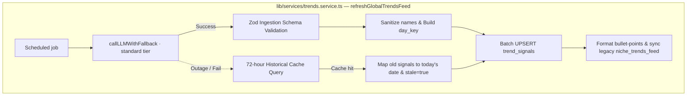
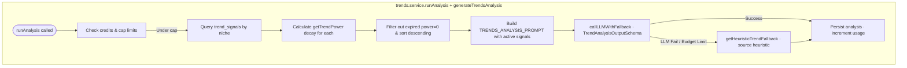

# Trendoraa AI Trend Analysis & Niche Strategy System

This document outlines the architecture, data structures, and prompt schemas for the **AI Trend Analysis & Niche Strategy System**. This engine powers Trendoraa's competitive differentiator: generating dynamic video content strategies by cross-referencing a creator's raw performance history (e.g., skip rates, watch-through rates) with platform-wide structured viral trends, platform indicators, and decay factors.

---

## 🗺️ Ingestion & Strategy Generation Pipeline

To maintain near-$0 overhead and absolute uptime, Trendoraa separates external trend crawling from individual creator requests by utilizing a **Cached, Structured Trend Signals Indexer**. A single daily cron job fetches platform-wide viral trends per niche, validates the output using strict Zod structures, sanitizes keys, and caches them as separate relational entities in the `trend_signals` table. 

When a creator triggers a trend analysis, the system queries the active cached trend signals, applies a time-decay factor based on signal age, sorts them by relevancy, and enqueues the dynamic prompt.

### 1. Daily Niche Trends Indexer (Cron)



*Source of truth: `lib/services/trends.service.ts`, `lib/validators/trend-schema.ts`, `lib/ai/llm-with-fallback.ts`.*

### 2. Per-Creator Trend Analysis (On Demand)



*Source of truth: `lib/ai/trend-generator.ts`, `lib/ai/prompts/trends.ts`, `lib/services/trends.service.ts`.*

---

## 🛡️ Ingestion Validation Schemas (Zod)

The ingestion cron parses LLM results into five distinct structured signal structures using the `TrendIngestionSchema` (`lib/validators/trend-schema.ts`). Bounding array fields to `.default([])` guarantees graceful degradation during partial JSON failures:

```typescript
import { z } from "zod";

export const SurgingHashtagSchema = z.object({
  tag: z.string().min(1),
  estimated_reach: z.number().int().nonnegative(),
  trend_strength: z.number().int().min(1).max(100),
});

export const TrendingAudioSchema = z.object({
  name: z.string().min(1),
  platform_id: z.string().optional(),
  genre: z.string().min(1),
  surge_percentage: z.number().nonnegative(),
});

export const ViralFormatSchema = z.object({
  name: z.string().min(1),
  description: z.string().min(1),
  example_accounts: z.array(z.string()).default([]),
});

export const EditingPatternSchema = z.object({
  description: z.string().min(1),
  effectiveness_score: z.number().int().min(1).max(10),
});

export const TopicSurgeSchema = z.object({
  topic: z.string().min(1),
  angle: z.string().min(1),
  estimated_engagement_lift: z.number().nonnegative(),
});

export const TrendIngestionSchema = z.object({
  surging_hashtags: z.array(SurgingHashtagSchema).default([]),
  trending_audios: z.array(TrendingAudioSchema).default([]),
  viral_formats: z.array(ViralFormatSchema).default([]),
  editing_patterns: z.array(EditingPatternSchema).default([]),
  topic_surges: z.array(TopicSurgeSchema).default([]),
  time_sensitivity_hours: z.number().int().positive().default(24),
});

export type TrendIngestionOutput = z.infer<typeof TrendIngestionSchema>;
```

---

## 🔑 Sanitization & Database Keys

To preserve uniqueness, standard parameters (`niche`, `platform`, `signalType`, `uniqueName`, `todayStr`) compose the unique row constraint key (`day_key`). Colons, spaces, and delimiters are sanitized:

```typescript
const sanitize = (name: string) => name
  .toLowerCase()
  .replace(/:/g, '-')
  .replace(/\s+/g, '-')
  .replace(/-+/g, '-')
  .substring(0, 80)
  .trim();

const dayKey = `${niche}:${platform}:${type}:${sanitize(uniqueName)}:${today}`;
```

---

## 📉 Temporal Decay Model

Trends are highly time-sensitive. The engine weighs signals using a linear decay equation inside the `getTrendPower(signal)` utility helper:

$$\text{TrendPower} = \max\left(0, 1 - \frac{\text{Hours Since Ingested}}{\text{Time Sensitivity Hours}}\right)$$

Decayed signals (power = 0) are excluded from analysis runs. Active trend signals are formatted with their respective decay percentages, driving accurate prioritization inside creator recommendations:

```typescript
const activeSignals = await db
  .select()
  .from(trendSignals)
  .where(eq(trendSignals.niche, accountNiche));

const validActiveSignals = activeSignals
  .map(sig => ({ ...sig, power: TrendService.getTrendPower(sig) }))
  .filter(sig => sig.power > 0)
  .sort((a, b) => b.power - a.power);
```

---

## 📝 The `TRENDS_ANALYSIS_PROMPT`

Below is the prompt template utilized by `lib/ai/prompts/trends.ts` to analyze dynamic trend signals weighted by active decay indices:

```typescript
export const TRENDS_ANALYSIS_PROMPT = `
You are a master social media algorithms engineer and viral growth strategist. Your task is to analyze raw platform trend data (audios, hashtags, topics) and cross-reference them with a specific creator's performance history and niche parameters to generate actionable content hooks and strategic alignment scores.

## 1. Creator Profile
- Handle: @{username}
- Niche: {niche} (e.g., tech, comedy, finance, education, lifestyle, fashion)
- Primary Goal: {goal} (e.g., audience retention, engagement, follower growth)
- Historical Performance:
  - Avg engagement rate: {avg_engagement_rate}%
  - Avg skip rate (Instagram): {avg_skip_rate}%
  - Avg completion rate (TikTok): {avg_completion_rate}%

## 2. Ingested Trend Signals (Decay Weighted)
{ingested_trend_signals}

## 3. Creator's Recent Content History
{recent_content_history}

## 4. Instructions
Analyze the raw trend signals through the strict lens of the creator's specific {niche} content. Map out exactly:
- **Niche Trend Score:** How well current platform-wide trends align with their topic authority (1-100).
- **Viral Sound Alignment:** Identify which high-velocity audio formats can be adapted to their format.
- **Hook Mutations:** Take 3 high-velocity platform hooks and mutate them specifically to fit the creator's niche and goal.
- **Actionable Content Blueprints:** Draft 3 quick-execution Reel/TikTok ideas utilizing these trends.

Return ONLY a valid JSON payload matching this Zod-enforceable schema:
{
  "niche_trend_score": <number 1-100>,
  "trend_verdict": "<1-2 sentence high-level trend summary>",
  "trend_pillars": [
    {
      "trend_name": "<string>",
      "velocity": "high|surging|stable",
      "niche_relevance": "<string explaining how this niche can utilize it>"
    }
  ],
  "sound_recommendations": [
    {
      "audio_name": "<string>",
      "original_link": "<string>",
      "usage_type": "background_music|voiceover_underlay|pattern_interrupt",
      "editing_instruction": "<specific editing instruction like 'cut on beat 4' or 'fade at 3s'>"
    }
  ],
  "hook_mutations": [
    {
      "original_trend_hook": "<string describing the viral platform hook>",
      "mutated_niche_hook": "<the exact 3-second text overlay/spoken line for this creator>",
      "psychological_trigger": "<why this mutated hook lowers skip rate or drives saves>"
    }
  ],
  "actionable_blueprints": [
    {
      "title": "<string>",
      "format": "fast_reel|talking_head|aesthetic_broll|split_screen",
      "topic": "<specific topic tailored to niche>",
      "visual_directions": "<brief editing/shooting instructions>",
      "suggested_duration_seconds": <number>
    }
  ]
}
`;
```

---

## 🛠️ Data-Driven Heuristic Outage Fallback

If all candidate LLM models are exhausted (rate limits saturated or API credit exhaustions), the worker falls back to the heuristic strategy engine, returning a deterministic template corresponding to their chosen `niche`:

```typescript
export function getHeuristicTrendFallback(niche: string): TrendAnalysisOutput {
  const defaults: Record<string, TrendAnalysisOutput> = {
    tech: {
      niche_trend_score: 75,
      trend_verdict: "Standard tech topics are stable, with increased interest in minimal physical workspace integrations.",
      trend_pillars: [{ trend_name: "Minimalist Desks", velocity: "stable", niche_relevance: "Highlight clean workstation aesthetics." }],
      sound_recommendations: [{ audio_name: "Synth Wave beats", usage_type: "background_music", editing_instruction: "Use rapid cuts on audio transients." }],
      hook_mutations: [{ original_trend_hook: "Stop scrolling if you want...", mutated_niche_hook: "Stop scrolling if your desk setup looks like this...", psychological_trigger: "Endowment effect and visual curiosity." }],
      actionable_blueprints: [{ title: "Desk Tour", format: "aesthetic_broll", topic: "Optimal desk layout", visual_directions: "Slow panning shots over items", suggested_duration_seconds: 12 }]
    },
    comedy: {
      niche_trend_score: 80,
      trend_verdict: "Relatable workplace skits are surging on short-form feeds.",
      trend_pillars: [{ trend_name: "Corporate Satire", velocity: "surging", niche_relevance: "Adapt common remote work scenarios to your comedy." }],
      sound_recommendations: [{ audio_name: "Silly woodwind effects", usage_type: "pattern_interrupt", editing_instruction: "Insert immediately after punchline." }],
      hook_mutations: [{ original_trend_hook: "Tell me you work in X without...", mutated_niche_hook: "Tell me you're a remote software engineer without saying it...", psychological_trigger: "Instantiates instant relatability." }],
      actionable_blueprints: [{ title: "The Standup Meeting POV", format: "talking_head", topic: "typical agile standups", visual_directions: "Quick lens shifts to mimic different meeting members", suggested_duration_seconds: 15 }]
    }
  };

  return defaults[niche] || defaults.tech;
}
```
