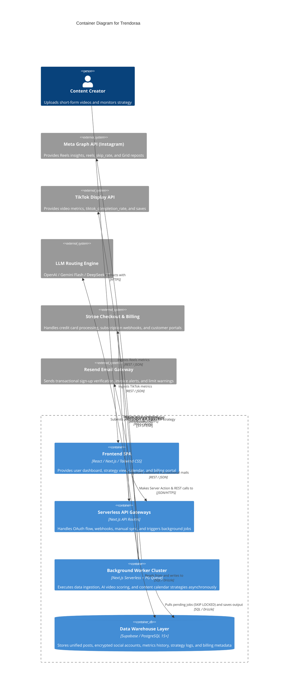
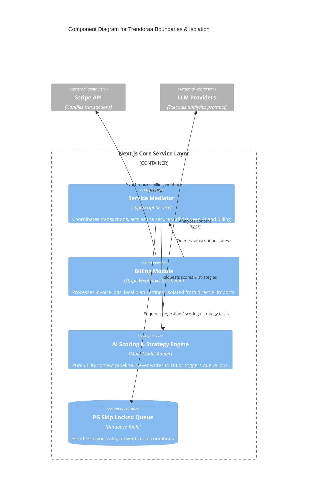
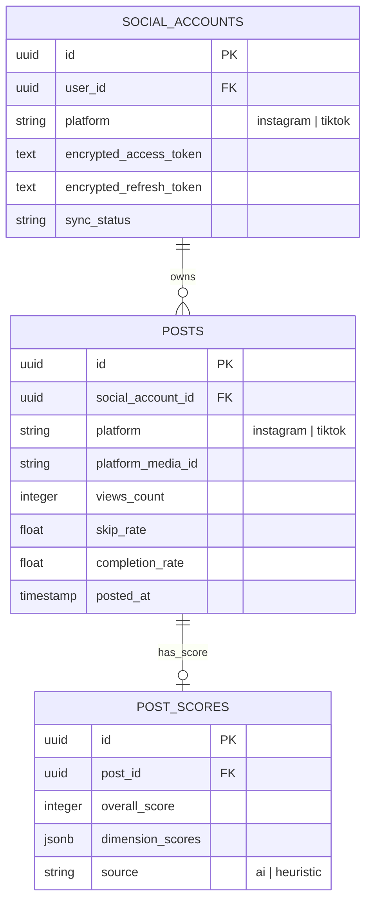

# Architecture Decision Record (ADR) — Trendoraa

**Document Version:** 1.0.0  
**Status:** Approved  
**Author:** Software Architect & Principal Engineer  

---

## 1. High-Level Architecture (Spec §2.1)

The system is designed around a unified Next.js monorepo architecture leveraging Supabase for serverless infrastructure services, combining database, authentication, and file storage into a single operational tier. The application decouples operational boundaries at the service layer, keeping execution units isolated and clean.



---

## 2. Technology Stack (Spec §2.2)

The core technology stack is strictly locked. No substitutions or additions are permitted. This stack was selected to achieve a high degree of developer productivity, type-safety, and operational simplicity:

| Layer | Technology | Architectural Rationale |
|:---|:---|:---|
| **Frontend Framework** | Next.js 14+ (App Router) | Enables React Server Components (RSC) to minimize client-side bundle sizes and leverages Server-Side Rendering (SSR) for instantaneous page loading. |
| **UI Styling** | shadcn/ui + Tailwind CSS v4 | Provides premium, custom-tailored CSS styling based on modern design standards with full accessibility out of the box. |
| **Backend API** | Next.js API Routes + Server Actions | Establishes a collocated, type-safe API routing framework without the overhead of deploying and configuring a separate server application. |
| **Database Engine** | Supabase (PostgreSQL 15+) | Serves as the single data warehouse, providing enterprise storage capabilities, native Row-Level Security, and cryptographic utilities. |
| **ORM Layer** | Drizzle ORM | Provides an SQL-first, lightweight, compile-time type-safe mapper. Eliminates ORM runtime overhead and maps complex database queries natively. |
| **Authentication** | Supabase Auth (GoTrue) | Manages authentication flows natively, supporting secure OAuth2 handshakes for Instagram and TikTok logins and session tokens. |
| **Background Queue** | Custom PG SKIP LOCKED Queue | Eliminates the cost and operational footprint of Redis or Kafka. Provides database-native ACID-compliant job processing. |
| **AI/LLM Engines** | OpenAI GPT-4o/mini, Gemini 2.0 Flash, DeepSeek-V3 | Multi-model routing tier ensures >98% cost savings on batch analyses while retaining GPT-4o for high-value strategies. |
| **Payment Gateway** | Stripe Subscriptions + Checkout | Standardizes subscription logic and billing portal generation, utilizing secure webhook signatures. |
| **Email Gateway** | Resend | transactional email delivery service with simple REST APIs, tailored for serverless execution runtimes. |
| **Deployment Platform**| Vercel (Frontend) + Supabase (DB) | Minimizes deployment surface by automating serverless function distribution, SSL management, and database replication. |
| **Error Monitoring** | Sentry + Custom Telemetry Logs | Logs production anomalies and error traces, mapping errors directly to source files while keeping user secrets redacted. |
| **CI/CD Pipeline** | GitHub Actions | Automates codebase verification, ESLint structural boundaries checks, and schema validation on every branch merge. |


---

## 3. Hard Architectural Constraints (Spec §2.2 & §9)

The platform operates under a strict **Zero-Extra-Infrastructure** constraint to eliminate serverless cold-start overhead, control operational budgets, and enable a solo-founder to easily monitor the system.

* **NO Redis / NO Memcached:** Caching is achieved natively using PostgreSQL Row Level Caching, application-level In-Memory SWR (Stale-While-Revalidate) cycles, and CDN caching headers.
* **NO Kafka / NO RabbitMQ:** Event streaming is banned. High-throughput data ingestion is structured into sequential database queues, avoiding complex multi-cluster messaging patterns.
* **NO Microservices:** All backend services run under a monolithic Next.js repository, compiled into serverless API endpoints and long-running unified worker routines.
* **PostgreSQL-Only Queue (`SKIP LOCKED`):** Background jobs are managed using a custom task queue utilizing PostgreSQL’s native concurrency features:
  * Workers pull jobs using `SELECT * FROM job_queue WHERE status = 'pending' FOR UPDATE SKIP LOCKED LIMIT 1`.
  * This query isolates workers, prevents race conditions, enforces strict ACID transactions, and prevents job duplication.
  * Eliminates the need to maintain or pay for a separate queuing cluster (e.g. Redis/BullMQ).

---

## 4. Module Boundary Map & Isolation (Spec §18 RULE 3)

The architecture establishes rigid structural walls around core logical modules. Cross-module imports are blocked at compile-time to maintain absolute service separation.



### 4.1 Boundary Rules & Import Guard Policies
1. **Billing Isolation:** The `Billing` module operates purely on Stripe webhook parsing and subscription table modifications. It never imports functions from the `AI` engine or enqueues items into the `Queue` directly.
2. **AI Module Purity:** The `AI` module is a pure execution pipeline. It receives raw parameters and returns typed values. It **never** writes directly to DB tables, and it **never** makes network requests to external APIs other than OpenAI. All database writes are mediated by the `Service` layer.
3. **Queue Ingestion Limits:** Webhook routes and API endpoints never execute heavy business or synchronization logic. They extract parameters and write a `pending` job into the queue, deferring runtime load to workers.
4. **Compile-Time Enforcement:** A custom ESLint rule inside `eslint.config.mjs` enforces imports limits. Public routes under `app/(public)/**/*` are restricted from importing `@/lib/db`, `@/lib/supabase`, or `@/lib/crypto`.
5. **Database Transaction Safety:** The `Service` mediator wraps cross-module routines in standard SQL transactions. If an AI write or webhook ingestion step fails, the transaction rolls back, preventing data corruption.

---

## 5. Cost Model & Blended FinOps Estimate (Spec §12.1)

To ensure high profitability from Day 1, the platform operates on highly optimized infrastructure costs:

### 5.1 Fixed Infrastructure Costs
* **Supabase Pro Tier:** $25.00 / month
* **Vercel Pro Team Tier:** $20.00 / month
* **Sentry Developer Tier:** $26.00 / month
* **Resend Professional Tier:** $20.00 / month
* **Total Base Fixed Cost:** **$91.00 / month**

### 5.2 Variable Cost Targets (Per-User API Costs)
* **Gemini 2.0 Flash / DeepSeek-V3 (Batch/Budget Scoring):** ~$0.0003 / post analyzed (98%+ cost savings)
* **GPT-4o-mini (Real-time Standard Scoring):** ~$0.0006 / post analyzed
* **GPT-4o (Premium Strategy & Analysis):** ~$0.08 / Strategy run (avg. 2,000 input, 2,000 output tokens)
* **Stripe Fees:** 2.9% + $0.30 per customer transaction
* **Instagram & TikTok API Queries:** $0.00 (Free)

### 5.3 Blended Cost Model per 1,000 Active Users
Using a standard seed-stage SaaS product user distribution and our strictly cost-capped pricing tiers, the variable and fixed costs compute as follows:

* **User Mix Assumptions (1,000 total active users):**
  * **Free Tier:** 80% (800 users) — Variable cost: $0.00/user/mo (0 posts AI limit)
  * **Creator Tier:** 15% (150 users) — Variable cost: $1.07/user/mo (Capped at 50 posts analyzed with GPT-4o-mini + 4 weekly strategy runs)
  * **Pro Tier:** 4% (40 users) — Variable cost: $3.32/user/mo (Capped at 200 posts analyzed with GPT-4o-mini + 4 weekly strategy runs)
  * **Agency Tier:** 1% (10 users) — Variable cost: $24.00/user/mo (Avg 400 posts analyzed with GPT-4o + priority strategy briefs)

* **Monthly Cost Breakdown:**
  * **Free Tier Variable Cost:** 800 * $0.00 = $0.00 / month
  * **Creator Tier Variable Cost:** 150 * $1.07 = $160.50 / month
  * **Pro Tier Variable Cost:** 40 * $3.32 = $132.80 / month
  * **Agency Tier Variable Cost:** 10 * $24.00 = $240.00 / month
  * **Total Variable Expenses:** **$533.30 / month**
  * **Fixed Infrastructure Base:** **$91.00 / month**
  * **Blended Cost per 1K Users:** **$624.30 / month** (Approx. $0.62 / user / month average)

* **Gross Margin Metrics:**
  * **Creator Plan ($39/mo):** 97.2% Gross Margin ✅
  * **Pro Plan ($89/mo):** 96.2% Gross Margin ✅
  * **Agency Plan ($249/mo):** 90.3% Gross Margin ✅

---

## 6. External API Dependency & Fallback Strategy

The application adopts a defensive engineering mindset, treating all external integrations as unreliable dependencies:

### 6.1 Instagram Graph API (v22.0+)
* **Dependencies:** Media Ingestion, comment and engagement retrieval, ig_skip_rate insights.
* **Failure Vectors:** OAuth token expirations, 429 rate limit errors (200 requests/hr ceiling), network connection drops.
* **Fallback Strategy:**
  * **Stale-While-Revalidate (SWR) DB Reads:** Ingestion logic implements SWR caching. Dashboards load cached metrics instantly from PostgreSQL while launching worker threads in the background.
  * **Rate Limit Exponential Backoff:** API calls failing due to a 429 error automatically schedule a queue retry starting with a 1-minute delay, scaling exponentially up to 15 minutes before calling an admin alert.
  * **Manual Sync Protection:** Cooldown logic blocks frontend-triggered manual synchronization requests for 5 minutes per account.

### 6.2 TikTok Display API (v2+)
* **Dependencies:** Video Ingestion, engagement metrics, tiktok_completion_rate, tiktok_saves_count.
* **Failure Vectors:** Access token expiry (strict 24h lifetime), user revocation of refresh tokens, API endpoints downtime.
* **Fallback Strategy:**
  * **Proactive Daily Token Refresh:** A daily cron worker queries active TikTok connections and exchanges refresh tokens (1-year lifetime) for new access tokens. If user revocation occurs, the system marks the account `disconnected` and prompts user re-auth.
  * **Sequential Queue Workers:** Ingestion requests are processed sequentially (FOR UPDATE SKIP LOCKED) to preserve API limits (10,000 calls/day per client key).
  * **Scoring Heuristics Default:** If `saves_count` or `completion_rate` are returned null, the fallback algorithm uses baseline engagement calculations (`30.0%` for completion rate) without halting dashboard visualization.

### 6.3 AI Engine API (Multi-Model Routing & Fallbacks)
* **Dependencies:** Deep video scoring, hook quality analysis, strategy generation.
* **Failure Vectors:** LLM API server outages, connection timeouts, monthly user LLM budget or count overruns, Gemini free-tier rate limits (15 RPM).
* **Fallback Strategy:**
  * **Intelligent Routing Layer:** Routes real-time standard tier analyses to GPT-4o-mini, high-value strategy generation to GPT-4o, and background batch processing of older posts (>48 hours) to Gemini 2.0 Flash or DeepSeek-V3.
  * **Rate-Limit & Circuit Breakers:** Monitors Gemini's 15 RPM free tier; automatically bypasses to next-cheapest provider (DeepSeek-V3/GPT-4o-mini) on quota exhaustion.
  * **Monthly LLM Budget & Analysis Caps:** Before invoking any LLM, the system validates that the user is under their monthly count and budget caps. If exceeded, operations fall back to heuristics.
  * **Heuristic Fallback Engine:** If all configured API candidates fail or trip circuit breakers, the Heuristic Fallback Engine calculates exact mathematical scoring using native metrics (skip rate, completion rate, engagement velocity) to preserve dashboard rendering under `source: "heuristic"`. The upgraded heuristic includes follower tier skip-rate threshold scaling, video duration retention modifiers, log10 CTA magnitude scaling, views momentum classifications, peak active hour timing score calculations, and stretch normalization to map raw scores into a true 1-100 range.
  * **NaN Prevention Default:** If a new account lacks historical posts to calculate baseline averages, engagement defaults to `2.0%`, skip rate to `50.0%`, and completion rate to `30.0%` within calculations.

### 6.4 Stripe API
* **Dependencies:** Checkout portal redirection, customer subscription synchronization.
* **Failure Vectors:** Hook signature spoofing, delayed webhook events, failed invoice collections.
* **Fallback Strategy:**
  * **Atomic Event Deduplication:** Webhooks log Stripe `event_id` keys inside a unique `processed_events` table before processing, enforcing single execution via `ON CONFLICT DO NOTHING`.
  * **Stripe Retry Endpoints:** An administrative endpoint (`POST /api/webhooks/stripe/retry`) is provided to replay failed Stripe events manually using historical webhook payload logs.
  * **Billing Grace Periods:** Subscription status is persisted locally in the database. Active subscription states are given a 3-day grace period on invoice collection failure, preventing instant lockouts during bank collection drops.

### 6.5 Resend API
* **Dependencies:** Verification emails, billing change warnings, security alert logs.
* **Failure Vectors:** API downtime, recipient server rejections.
* **Fallback Strategy:**
  * **Queued Email Dispatch:** Verification emails are not dispatched inside sign-up API requests. They are saved in `job_queue` as `SEND_EMAIL` tasks.
  * **Transactional Resiliency:** A transient Resend service outage does not block system execution or user registrations; workers process queued emails asynchronously when the gateway recovers.

---

## 7. Security Model & Safeguards (Spec §11)

The system implements 6 secure defensive layers, protecting user data at rest, in transit, and during background runs.

### 7.1 Layered Security Architecture
1. **Network Layer:** All connections use HTTPS exclusively, utilizing Vercel's automated TLS configuration. API routes use CORS limits, blocking unauthorized domains, and enforce CSRF token validation.
2. **Authentication Layer:** GoTrue processes logins natively. Social access tokens are fetched using secure OAuth2 authorization codes, and user session cookies are protected via `httpOnly` and `SameSite` flags.
3. **Authorization Layer (RLS):** Row-Level Security is active on every single user-facing table in Supabase. Access policies enforce tenant isolation. RLS policies are validated on every migration and codebase update by running the automated simulation script (`scripts/test-rls.ts`).
4. **Data Protection Layer (Token Encryption):** Long-lived Instagram access tokens and TikTok refresh tokens are encrypted in PostgreSQL using the AES-256-GCM algorithm. Cryptographic payloads are saved using multi-version tracking keys inside `social_accounts`:
   * Format: `keyVersion:iv:authTag:ciphertext` (e.g., `v2:32byteIv:32byteTag:ciphertext`).
   * This multi-version format allows SOC2-compliant, zero-downtime key rotation by preserving historical keys in a decryption keys map variable (`TOKEN_ENCRYPTION_KEYS`).
5. **Webhook Security Layer:** Stripe webhooks verify HMAC-SHA256 headers before processing, and Instagram webhooks check `hub.verify_token` signatures to prevent payload injection.
6. **Application Security Layer:** Zod schemas validate all API payloads, preventing SQL injection via parameterized execution and securing against XSS via content escaping.

### 7.2 Log Sanitization Engine
To prevent token leakages in third-party monitoring services (Sentry/Vercel logs), all logged messages are processed through `sanitizeForLogs()` to redact secrets:

```typescript
// Central log redaction regular expressions:
const SECRET_PATTERNS = [
  { name: "stripe-live-key",       re: /\bsk_live_[A-Za-z0-9]{16,}\b/g },
  { name: "stripe-webhook-secret", re: /\bwhsec_[A-Za-z0-9]{20,}\b/g },
  { name: "stripe-publishable",    re: /\bpk_(?:live|test)_[A-Za-z0-9]{16,}\b/g },
  { name: "instagram-access-token",re: /\bEAAC[A-Za-z0-9]{100,}\b/g },
  { name: "tiktok-access-token",   re: /\bact\.[A-Za-z0-9_-]{32,}\b/g }
];
```

---

## 8. Unified Data Model Architectural Decision (Spec §4)

To prevent code duplication, logical drift, and database index clutter, we made the architectural decision to design a **Unified Data Model** (fully normalized tables) instead of splitting social networks into individual tables.

### 8.1 Schema Normalization Map
Instead of creating platform-specific tables (`instagram_accounts`, `tiktok_accounts`, `reels`, `tiktok_videos`), the system maps all connections to unified entities:

```

```

* **`social_accounts`:** Stores connected social entities, tracking `platform` (`instagram` | `tiktok`) and utilizing AES-256-GCM encryption on token structures.
* **`posts`:** Stores ingested media metadata, unifying reels and TikTok videos into a platform-agnostic table. Accommodates nullable platform metrics such as `ig_skip_rate` and `tiktok_completion_rate` under a clean, unified index structure.
* **`post_scores`:** Links AI analysis directly to `posts`, scoring key visual/structural dimensions identically across platforms while modifying the LLM prompt context dynamically based on the post's platform indicator.

### 8.2 Operational Benefits
* **Staged Rollout Simplification:** Complete the Instagram ingestion layer first. Since the schema and core API query code are designed for cross-platform day one, starting the TikTok rollout requires zero table migrations or UI structural rewrites.
* **Cascading Delete Reliability:** Enforces clean GDPR purge cycles. Triggering deletion on `social_accounts` triggers a single, native PostgreSQL cascade that purges all corresponding `posts`, `post_scores`, and billing logs seamlessly.

