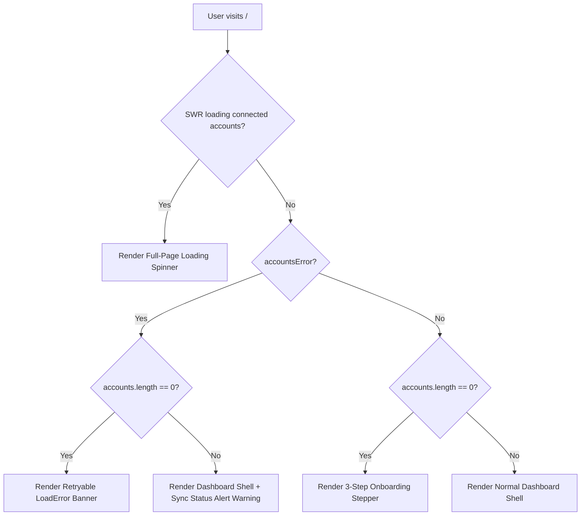

# Trendoraa User Onboarding Flow Architecture

This document describes the design, implementation, and architectural flow of the **Trendoraa User Onboarding Experience**. 

The onboarding flow is built on two core pillars:
1. **Behavioral Psychology:** Getting creators and businesses to their "first win" (seeing populated analytics and insights) within 60 seconds with minimal friction, using the **Progress Principle** and **Identity Reinforcement**.
2. **Technical Resiliency:** Surfacing platform API failures distinctly from blank workspaces, allowing graceful fallback to a high-fidelity **Sandbox Demo** environment when production OAuth connections are unavailable.

---

## 🗺️ Architectural Workflow Overview

Below is the state machine representation of the user onboarding state resolution on the home dashboard:

---

## 🔢 The 3-Step Onboarding Stepper

When a user has no connected accounts (`accounts.length === 0`), `app/(dashboard)/page.tsx` mounts the onboarding stepper rather than the default dashboard workspace. 

### 1. Step 1: Content Niche Selection
* **UI Action:** A responsive grid presenting six key content niches: Tech & Gadgets, Comedy & Skits, Business & Finance, Education & How-to, Lifestyle & Vlogs, and Fashion & Beauty.
* **Goal:** Lowers entry friction and establishes the user's creative identity inside the system. 
* **State Persisted:** `niche` state variable.

### 2. Step 2: Growth Goal Selection
* **UI Action:** Creator chooses their primary operational growth metric focus:
  * **Audience Retention** (Hook scroll-stop performance)
  * **Engagement Rate** (Optimize shares/saves)
  * **Active Followers** (Posting schedule velocity)
* **Goal:** Establishes user intent and sets expectations for customized metrics feedback.
* **State Persisted:** `goal` state variable.

### 3. Step 3: Social Connection or Sandbox Fallback
This step presents two clear choices:
1. **Explore Sandbox Demo Account:** The **recommended first-win engine** that connects the user to a pre-seeded mockup environment within seconds.
2. **Production Connect:** Initiates production OAuth connect flows for Instagram Business or TikTok accounts.

---

## 🧪 Sandbox Seeding Mechanics (`POST /api/accounts/demo`)

To provide immediate value without requiring live production authorization, the **Explore Sandbox Demo** button performs the following operational loop:

1. **Wow-Effect Visual Simulation:**
   * Before executing the request, the client runs a simulated progress spinner highlighting core technical steps (e.g., *"Connecting to Trendoraa AI ingestion pipeline..."*, *"Calculating AI Engagement Moat Index..."*). This builds anticipation, reinforcing the Endowment Effect.
2. **API Call (`POST /api/api/accounts/demo`):**
   * The API first searches the database for the pre-seeded account `alice_reels`.
   * **Success Path:** Links the `alice_reels` Instagram account, strategies, and post data to the currently authenticated `userId`.
   * **Fallback Path:** If the seed was never run, the endpoint dynamically instantiates a mock account `alice_reels` and seeds two high-fidelity mock reels directly to the current user's profile to prevent a blank state.
3. **Re-validation:**
   * On success, the client triggers `mutateAccounts()`, prompting the app to transition instantly from the onboarding stepper to the populated dashboard shell.

---

## 🎨 Personalized Workspace Matching

To prevent an immersion break after onboarding, the home dashboard personalized strategy cards dynamically read the user's selected niche and goal states:

### 1. Topic Strategy Customization
The sample weekly content strategy lists custom topics corresponding directly to the selected niche in Step 1 using a defined constant map:

* **Tech:** *"CSS Grid vs Flexbox"*, *"Setup Gear Unboxing"*
* **Comedy:** *"When the server goes down mid-demo 🎭"*, *"Expectation vs Reality: AI pair programming 💻"*
* **Finance:** *"3 Indicators I watch for market pivots 📈"*, *"How creators structure LLCs 🏢"*
* **Education:** *"How the Transformer Attention Mechanism works 🧠"*, *"Why database indexing drops writes 📊"*
* **Lifestyle:** *"My digital nomad morning setup in Kyoto ✈️"*, *"Co-working spaces that don't feel like cubicles ☕"*
* **Fashion:** *"Aesthetic palette matching for dark-mode desks ✨"*, *"Summer office capsule wardrobe 👗"*

### 2. Goal Highlight Badges
The dashboard bento metric cards map a glowing **`🎯 Goal Focus`** badge onto the metric corresponding to the growth goal chosen in Step 2, focusing the user's eyes on their primary metric target immediately upon entering.

---

## 🛡️ Resiliency & Error Recovery Systems

Production OAuth is highly prone to failures (e.g., user declines permissions, user has a personal instead of a business profile, network timeout). The onboarding UX is safeguarded by two recovery layers:

### 1. `OAuthErrorBanner` (`components/dashboard/oauth-error-banner.tsx`)
* **Behavior:** Reads `?error=` search parameters from the URL upon callback and maps them to clean, plain-language error alerts (e.g., telling the user they need to convert their profile to a Creator/Business account to link Instagram).
* **Self-Cleaning:** Automatically strips the `?error` parameters from the address bar on mount, preventing refreshing the page from repeatedly popping up the alert.

### 2. Retryable Network Failure Banner
* **Behavior:** If `GET /api/accounts` fails with a `500` or a network drop, the dashboard blocks the onboarding wizard from rendering (since the user might actually have linked accounts that we just failed to load). Instead, it shows the `LoadError` retry banner, allowing the user to refresh SWR states.

---

## 📂 Key Code Components

* **`app/(dashboard)/page.tsx`:** Primary client dashboard controller. Coordinates the onboarding stepper state machine, simulated progress syncing, loading state blocks, and personalized strategical widgets.
* **`components/dashboard/oauth-error-banner.tsx`:** Handles translation and self-cleaning dismissal of callback parameters.
* **`app/api/accounts/demo/route.ts`:** Seeding database handler for mock profiles.
* **`components/shared/active-account-context.tsx`:** Coordinates active account state across the entire panel.
