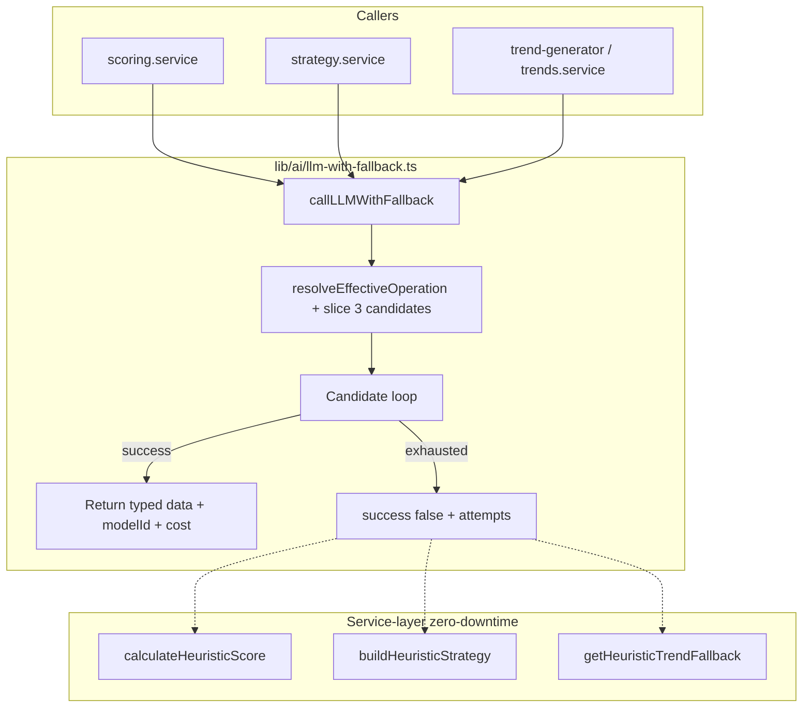
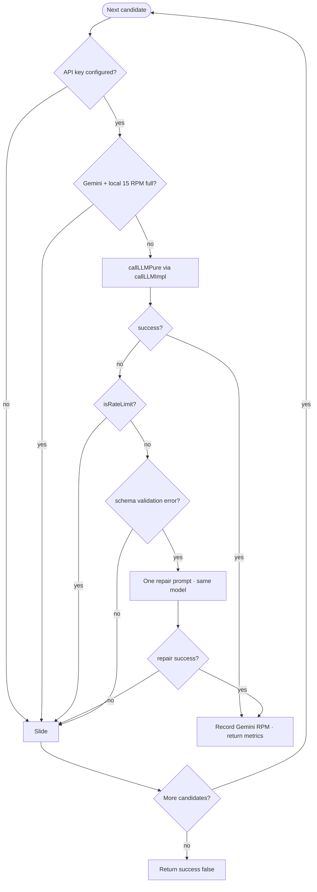

# LLM Stack Migration & Resilient Routing Architecture Guide

This document defines the production-grade LLM routing matrix, candidate fallbacks, cost structures, and error-recovery behaviors configured in Trendoraa. It serves as the engineering reference for the fully migrated AI routing layer (Google Gemini 2.0/2.5 Flash + DeepSeek, with OpenAI completely removed).

---

## 1. Primary Design Principles

1. **Best Strategy at Lowest Sensible Cost**: Avoid over-paying for high-volume tasks by utilizing Gemini 2.0 Flash for batch processing and older posts, while leveraging DeepSeek V4-Flash (`deepseek-chat`) and Google Gemini 2.5 Flash for high-value strategic and ad-hoc operations.
2. **OpenAI Independent**: System boot validation and routing loops do NOT require `OPENAI_API_KEY`. The application boots flawlessly on `GEMINI_API_KEY` and/or `DEEPSEEK_API_KEY`.
3. **Graceful Degradation**: System failures, rate limits (HTTP 429), or schema mismatches trigger a multi-level fallback loop (Primary -> Fallback -> Heuristic fallback).
4. **Resilient Auto-Repair**: Zod schema/JSON validation mismatches trigger an in-flight, single-attempt "JSON repair request" on the same candidate model before sliding to the next fallback candidate.

---

## 2. Model Configuration Matrix & Cost Profiles

Official model specifications and price mappings configured in `lib/ai/model-router.ts`:

| Model ID | Provider | Display Name | Input Price (per 1K tokens) | Output Price (per 1K tokens) | Max Tokens | JSON Mode |
| :--- | :--- | :--- | :--- | :--- | :--- | :--- |
| `gemini-2.0-flash` | Google Gemini | Gemini 2.0 Flash (Budget) | \$0.000075 | \$0.00030 | 8,192 | Yes |
| `gemini-2.5-flash` | Google Gemini | Gemini 2.5 Flash (Budget Pro) | \$0.000075 | \$0.00030 | 8,192 | Yes |
| `deepseek-chat` | DeepSeek | DeepSeek V4 Flash | \$0.000140 | \$0.00028 | 4,096 | Yes |
| `deepseek-reasoner` | DeepSeek | DeepSeek V4 Reasoner (Thinking) | \$0.000550 | \$0.00219 | 8,192 | No* |

*\*Note: DeepSeek Reasoner (Thinking R1 tier) does not support structured JSON mode or custom temperature configuration. These are programmatically omitted in the `callDeepSeek` client adapter.*

---

## 3. Dynamic Workload Routing Tables

The wrapper resolves `effectiveOperation = resolveEffectiveOperation(operation, postedAt)` (maps old scoring posts to `batch_scoring`), then loads candidates via `getModelCandidates(effectiveOperation, tier)`:

### 3.1 `scoring` (Real-time single post scoring, age ≤ 48h)
* **Primary**: `deepseek-chat`
* **Fallback**: `gemini-2.0-flash`
* **Heuristic**: Local statistical heuristics (`calculateHeuristicScore`)

### 3.2 `batch_scoring` (Background scoring, age > 48h)
* **Primary**: `gemini-2.0-flash` *(prioritizes lowest input/output cost profiles)*
* **Fallback**: `deepseek-chat`
* **Heuristic**: Local statistical heuristics

### 3.3 `strategy` (Standard strategic recommendations & Standard Script Rewriting)
* **Description**: Used for standard strategy generation and Creator tier script rewrites.
* **Primary**: `deepseek-chat`
* **Fallback 1**: `gemini-2.5-flash`
* **Fallback 2**: `gemini-2.0-flash`
* **Heuristic**: Empty/Template strategies with offline tips (or error toast for script rewrite)

### 3.4 `strategy` (Premium Strategic Recommendations & Premium Script Rewriting)
* **Description**: Used for premium strategy generation and Pro/Agency tier script rewrites (leveraging DeepSeek Reasoner for deep copywriting reasoning).
* **Primary**: `deepseek-reasoner` *(leverages thinking model for premium creators)*
* **Fallback 1**: `deepseek-chat`
* **Fallback 2**: `gemini-2.5-flash`
* **Heuristic**: Template strategies with premium indicators (or error toast for script rewrite)

### 3.5 `analysis` (Ad-hoc feed/global trends analysis)
* **Primary**: `deepseek-chat`
* **Fallback 1**: `gemini-2.5-flash`
* **Fallback 2**: `gemini-2.0-flash`
* **Heuristic**: Baseline trends derived from database statistics

---

## 4. Fallback Workflow & Auto-Repair Lifecycle

When a service invokes `callLLMWithFallback<T>()`, execution is a bounded candidate loop (max 3 models). **Heuristic fallbacks live in the calling service**, not inside the wrapper.

> **Legend:** solid arrows = required control flow · service-layer dashed path = only after `success: false`

### 4.0 Overview — service to wrapper to heuristics



*Source of truth: `lib/ai/llm-with-fallback.ts`, `lib/services/scoring.service.ts`, `lib/services/strategy.service.ts`, `lib/ai/trend-generator.ts`.*

### 4.1 Detail — per-candidate loop



*Source of truth: `lib/ai/llm-with-fallback.ts`, `lib/ai/llm-client.ts`, `lib/ai/model-router.ts` (`resolveEffectiveOperation`, `geminiRateLimiter`).*

**Age routing:** `operation: "scoring"` with `postedAt` older than 48h resolves to `batch_scoring` candidates (Gemini 2.0 Flash first) via `resolveEffectiveOperation()`.

### 4.2 In-Memory Rate Limiter for Gemini Free Tier
To prevent hitting Google's strict **15 RPM** (Requests Per Minute) free quota in production, an in-memory sliding window rate limiter runs inside `model-router.ts`.
* Timestamps are pruned on a 60-second window; when 15 slots are full, Gemini candidates are **skipped** (not called).
* **RPM is recorded only after** a successful `callLLMPure` (or successful schema repair), so failed calls do not consume free-tier slots.

### 4.3 Auto-Repair Specification
If a candidate model returns malformed JSON or JSON that fails Zod validation:
1. The client intercepts the error.
2. It compiles a **system repair note**:
   ```
   [SYSTEM REPAIR NOTE]
   Your previous response was invalid JSON or did not match the required Zod schema. Return ONLY valid JSON matching the schema precisely. No markdown formatting, no code block backticks (e.g. ```json), no pre-amble.
   ```
3. A single retry is executed against the **same model**. If it passes, execution completes successfully. If it fails, the router moves to the next fallback candidate in the queue.

---

## 5. Security & Isolation

* **Content Security Policy (CSP)**: `connect-src` header inside `middleware.ts` restricts outgoing client/worker requests to only:
  * `https://generativelanguage.googleapis.com` (Gemini API)
  * `https://api.deepseek.com` (DeepSeek API)
  * Direct Stripe, Instagram, and Supabase endpoints.
  * `https://api.openai.com` is completely removed to prevent exfiltration or accidental OpenAI usage.
* **Sensitive Key Redaction**: `llm-client.ts` implements `sanitizeForLogs()` to guarantee that API keys matching `sk-`, `AIza`, or `dsk_` prefixes never leak into console, file, or cloud logs in the event of connection errors.

---

## 6. Verification & Test Suite Runbook

To guarantee absolute type-safety, correctness of retries, and correct branching behaviors under offline environments (CI/CD pipelines), three distinct validation commands are configured in `package.json`:

### 6.1 Resilient Fallback Unit Tests
* **Command**: `npm run eval:llm:fallback` (executes `scripts/eval-llm-fallback.ts` via `tsx`)
* **Scope**: decoupled unit testing of retry pathways, sliding windows, and in-flight schema repair triggers.
* **Assertions**: 27 strict, deterministic tests verifying mock timeouts, Zod repairs, `isRateLimit` bypasses, age-based `postedAt` scoring routes (posts >48h use `batch_scoring`), and missing key behaviors without any network calls.

### 6.2 Service Branching & Heuristic Integration Checks
* **Command**: `npm run test:service:branching` (executes `scripts/test-service-branching.ts` via `tsx`)
* **Scope**: verifies integration branching logic to heuristic scoring when LLM fallback fails, and Zod output schema conformity.
* **Assertions**: 12 strict tests confirming that failures in LLM fallback trigger `calculateHeuristicScore` with a strict `"heuristic"` source metadata parameter, and verifying that `generateTrendsAnalysis` returns fully compliant `TrendAnalysisOutputSchema` payloads.

### 6.3 Routing & Price Mappings Verification
* **Command**: `npm run eval:llm` (executes `scripts/eval-llm-routing.ts` via `tsx`)
* **Scope**: validates candidate lists, token pricing computations, and sliding limiter RPM pools.
* **Assertions**: 27 tests checking model routing priorities and in-memory limiter restoration. Supports opt-in live smoke tests using `EVAL_LLM_LIVE=1`.

