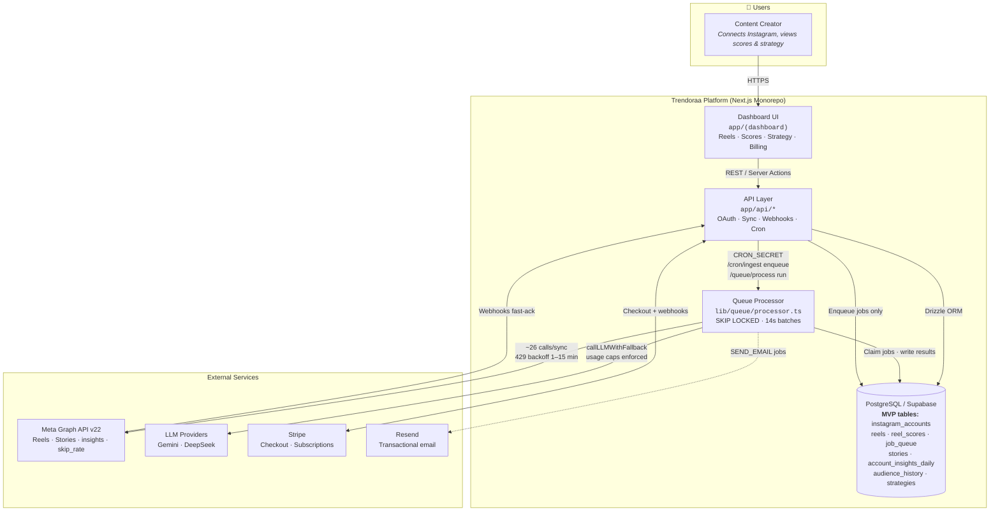
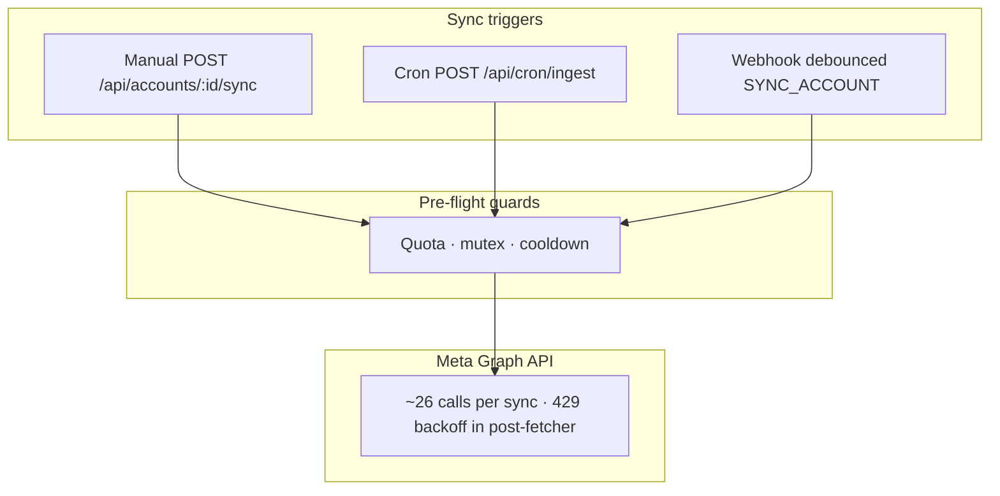

# Product Requirements Document (PRD) — Trendoraa

**Document Version:** 1.3.0  
**Status:** Validated & Approved (Instagram MVP annotations — Stories + Analytics overhaul)  
**Author:** Senior Product Manager  

> **Instagram MVP implementation map** — verify acceptance criteria against `lib/db/schema.ts` and `app/api/**`:
>
> | Spec / PRD (cross-platform target) | Implemented (Instagram MVP) |
> |---|---|
> | `social_accounts` | `instagram_accounts` |
> | `posts` | `reels` |
> | `post_scores` | `reel_scores` |
> | `GET /api/accounts/:id/posts` | `GET /api/accounts/:id/reels` |
> | `GET\|POST /api/posts/:id/score` | `GET\|POST /api/reels/:id/score` |
> | OAuth initiation | `POST /api/auth/social/instagram` → `{ authUrl }` + CSRF cookie |
> | Graph API `reels_skip_rate` | stored as `reels.skip_rate` |
>
> TikTok tables, routes, and cron ingestion are Post-MVP unless a story explicitly marks **Status: Implemented**.

---

## 1. Executive Summary & Problem Statements

Trendoraa is an AI-powered cross-platform strategy platform that automates the analysis of Instagram Reels and TikTok Videos, scores them across key visual and structural dimensions, and outputs personalized content calendars. By shifting the creator workflow from intuition-driven guessing to highly tailored, data-backed execution, the platform establishes a high-margin business model with an exceptionally low operational footprint.

### 📅 Staged Rollout Timeline
To optimize development velocity and establish immediate product-market validation, Trendoraa follows a strict two-stage launch strategy:
1. **Phase 1: Instagram MVP Launch (Initial Rollout)**: Launch exclusively with Instagram Professional account connection, Reel ingestion, 9-dimension hook scoring, AI strategies, and Stripe billing. The goal is to rapidly deploy a high-value core product, validate unit economics, and acquire the first paying subscribers.
2. **Phase 2: TikTok Post-MVP Expansion**: Once the Instagram MVP is launched and has acquired active paying users, the platform will implement the TikTok Display API integration, including 24-hour token rotation pipelines, sequential ingestion queue routines, TikTok-specific metrics, and cross-platform dashboard filters.

### 1.1 Core Problem Statements (Spec §1.2)

1. **Blind Posting:** Short-form video creators and brands publish Instagram Reels and TikTok Videos with no systematic understanding of *why* specific videos perform exceptionally well while others fail. Native analytics aggregate passive views but hide critical user retention and drop-off markers.
2. **Strategy Paralysis:** The creator ecosystem is filled with generic, uncontextualized growth advice that ignores platform differences and individual account niches. Creators lack a clear, personalized, and actionable cross-platform posting playbook.
3. **Severe Time Sink:** The process of manually exporting, tracking, and analyzing video performance across multiple platforms (Instagram and TikTok) in spreadsheets is structurally unsustainable for solo creators and social media teams.

---## 2. Target Audience & Customer Segmentation (Spec §1.4)

The platform targets three high-value customer segments, focusing on users who rely heavily on video content across both Instagram Reels and TikTok Videos for audience acquisition and brand equity:

| Segment | Description | Target Willingness to Pay |
|:---|:---|:---|
| **Primary** | **Creators & Influencers:** Independent creators (10K–500K followers) actively posting Reels and TikToks who need fast, data-backed cross-platform advice to sustain organic traffic. | $39.00 – $89.00 / month |
| **Secondary** | **Social Media Managers (SMMs):** Professionals handling 3 to 10 distinct client brand accounts across multiple platforms who need automated, white-label PDF reporting and multi-account strategy dashboards. | $89.00 – $249.00 / month |
| **Tertiary** | **Direct-to-Consumer (D2C) Brands:** Growing e-commerce brands utilizing Reels and TikToks as core acquisition channels to scale conversion rates, direct traffic, and product sales. | $249.00 – $499.00 / month |

---

## 3. Product Tier & Feature Matrix (Spec §1.6)

The platform operates on a tiered monthly subscription model structured around database size limits, account seats, monthly AI post analysis caps, and specialized AI outputs. It is strictly cost-optimized to safeguard profit margins (>90% Gross Margin):

| Feature Area | Free ($0/mo) | Creator ($39/mo) | Pro ($89/mo) | Agency ($249/mo) |
|:---|:---|:---|:---|:---|
| **Connected Instagram Accounts** | Max 1 | Max 2 | Max 5 | Max 20 |
| **Reels scored per billing cycle** | 10 | **50** | **200** | **1000** |
| **Monthly AI call cap** | 10 | **150** | **600** | **2500** |
| **Strategies per billing cycle** | 0 | 4 | 12 | 40 |
| **Data sync (Instagram MVP)** | Manual trigger only | Manual trigger only | Manual trigger only | Manual trigger only |
| **Scheduled background sync** | Hourly cron enqueue | Hourly cron enqueue | Hourly cron enqueue | Hourly cron enqueue |
| **Monthly LLM budget cap (design target)** | $0.50 | **$8.00** | **$25.00** | **$75.00** |
| **AI Scoring Engine** | Heuristic + capped AI | 9-Dimension (Standard Routing) | 9-Dimension (Standard Routing) | 9-Dimension (Premium Routing) |
| **Content Strategy** | Basic metrics | Weekly strategy generation | Advanced strategy + calendar | Custom white-label strategy briefs |
| **Trend Detection** | None | None | 3-Account competitive trends | 10-Account cross-brand trends |

> **Enforced limits:** `lib/billing/plans.ts` → `PLAN_LIMITS`. TikTok account seats and cross-platform filters are Post-MVP (Phase 11).

---

## 3.5 System Architecture Overview

To support cross-platform ingestion, AI scoring, and background strategy compile jobs, the system maps logical responsibilities to four main container units:

> **Legend:** solid arrows = synchronous request/response · dashed arrows = optional or async jobs

*Source of truth: `app/(dashboard)/*`, `app/api/*`, `lib/queue/processor.ts`, `lib/db/schema.ts`.*

---

## 4. API Integration Constraints & Rate Limits

Integration with external social platforms is subject to structural limits. All database designs and worker schedules conform to these constraints:

### 4.1 Meta Graph API v22.0+ (Instagram Reels)
* **Quota Allocation:** 200 API calls per hour per connected Instagram account (Graph API user context).
* **Pre-Flight Guard (implemented):** `syncAccount()` calls `checkInstagramQuotaForSync()` (`lib/ingestion/instagram-quota.ts`) before any Graph API fetch. Hourly usage is tracked per account in `instagram_api_hourly`. Sync aborts with `IG_QUOTA_EXHAUSTED` when `current + estimated_calls > 200 - 10` (10-call reserve).
* **Fetch-Layer Backoff (implemented):** `lib/ingestion/post-fetcher.ts` retries HTTP 429 with 1m → 15m backoff inside a single sync.
* **Queue Backoff (implemented):** Failed jobs that hit Instagram rate limits use minute-scale retries (`lib/ingestion/rate-limit-policy.ts` → `lib/queue/processor.ts`), not sub-second exponential retry.
* **Sync Mutex (implemented):** Only one active `syncing` lock per `instagram_accounts` row; stale locks reclaim after 10 minutes (`SYNC_IN_PROGRESS` if another sync holds the lock).
* **Webhook Coalescing (implemented):** Webhook HTTP handler enqueues `PROCESS_WEBHOOK` with per-event idempotency. The worker **does not** call Graph inline — it enqueues a debounced `SYNC_ACCOUNT` job (`sync:webhook:{accountId}:{debounce_bucket}`, 10-minute window). Accounts in `rate_limited` skip webhook enqueue.
* **Cron Scheduling (implemented):** `POST /api/cron/ingest` enqueues stale accounts (>6h, not `disconnected` / `rate_limited` / active `syncing`) with 30s stagger; **does not** process inline. `POST /api/queue/process` (Vercel cron every 5m) runs `processQueueBatch`.
* **Manual Cooldown:** User-initiated `POST /api/accounts/:id/sync` keeps the 5-minute cooldown; cron/webhook jobs pass `skipCooldown: true`.

*Source of truth: `lib/ingestion/sync.ts`, `lib/ingestion/post-fetcher.ts`, `lib/ingestion/rate-limit-policy.ts`, `lib/queue/processor.ts`.*

### 4.2 TikTok Display API v2+
* **Quota & Rate Limits:** 10,000 requests per day per client key.
* **Authentication Constraints:** Unlike Meta Graph API which provides long-lived access tokens that refresh silently, the TikTok Display API issues an access token with a strict 24-hour lifespan. It also issues a long-lived `refresh_token` with a 1-year lifespan.
* **Token Refresh Cycle:** A daily background job queries all TikTok connections, checks if their access tokens expire within the next 4 hours, and performs a refresh POST call to the TikTok OAuth exchange endpoint. If the refresh fails due to user revocation, the social account is flagged as `disconnected`, and the user is sent an email notification to re-authenticate.
* **Sequential Polling:** TikTok does not natively support real-time webhook video triggers. To prevent hitting platform rate limits, the Skip Locked background worker runs synchronization tasks sequentially using a FIFO queue.

---

## 5. API Deprecation & Platform Specifics (Spec §6.6)

The platform isolates platform-specific API differences at the ingestion level while storing metrics in a normalized schema.

### 5.1 Instagram-Specific Metrics
* **`reels_skip_rate` (Graph API) → `skip_rate` (database):** The percentage of viewers who scroll past the Reel within the first 3 seconds. Nullable if under 5 views. Fallback scoring baseline: `50.0%` for missing entries. The heuristic engine dynamically scales the skip-rate thresholds by follower tier (<10K, 10K-100K, 100K-500K, >500K) to keep evaluations fair for larger accounts. Dashboard copy reframes this as *Strategic Skip Resistance* / *Hook Retention Moat*.
* **`public_reposts` (Graph API):** The count of public grid reposts (excluding direct messages and private story shares). Stored on `reels.public_reposts`.
* **Deprecated Metrics:** `plays`, `impressions`, `ig_reels_aggregated_all_plays_count`, and `clips_replays_count` are fully deprecated or removed. The system maps all older media to `views` and tracks normalization via `display_views` + `metric_source`.
* **Fetch status (MVP):** `REEL_INSIGHT_METRICS` in `lib/ingestion/post-fetcher.ts` requests `reels_skip_rate`, `total_views`, `public_reposts`, plus engagement and Reel watch-time fields. Values map to `reels.skip_rate`, `reels.total_views`, and `reels.public_reposts`.

### 5.2 TikTok-Specific Metrics
* **`tiktok_completion_rate` (Unique retention metric):** The percentage of viewers who watch the video from start to finish. Nullable. Fallback scoring baseline: `30.0%` for missing entries.
* **`tiktok_saves_count`:** The count of bookmarks/saves. Since saves are not exposed natively in some TikTok Display API versions, this metric is nullable. Fallback engine calculates heuristic engagement by ignoring saves if null.

---

## 6. MVP User Stories (Strict Verification)

All user stories are structured, testable, and completely free of ambiguous terms (`should`, `maybe`, `might`, `could`).

### 6.1 Authentication & Onboarding

#### Story 1: Multi-Platform Social Account Connection
As a Creator, I want to authenticate via Supabase Auth and link either my Instagram Professional account or my TikTok Creator/Business profile so that the system is authorized to ingest my content data.
* **Acceptance Criterion 1 (Instagram — implemented):** Clicking the "Connect Instagram" button `POST`s to `/api/auth/social/instagram`, which returns a Meta Facebook Login authorization URL; the browser then redirects there, returns a valid, long-lived access token, validates that the account type is Professional (rejecting personal profiles — OAuth redirect uses `?error=not_business_account`; API layer may return `INSTAGRAM_NOT_BUSINESS_ACCOUNT`), and writes it to **`instagram_accounts`** (MVP table; spec target: `social_accounts` with platform `"instagram"`).
* **Acceptance Criterion 2 (TikTok — Post-MVP):** Clicking the TikTok OAuth button launches the TikTok permission window, returns a short-lived `access_token` and a long-lived `refresh_token`, and writes both to `social_accounts` with platform `"tiktok"` and encrypted tokens using AES-256-GCM. **Status:** Not implemented; `POST /api/auth/social/tiktok` returns `PLATFORM_NOT_SUPPORTED`.

#### Story 2: User Sign-Up Verification
As a Creator, I want to receive a transaction verification email upon signing up so that I can securely activate my account and prevent bot registration.
* **Acceptance Criterion 1:** A successful user sign-up inserts a pending user record in the database and automatically queues a `SEND_EMAIL` job in the background table.
* **Acceptance Criterion 2:** The system blocks login access until the user clicks the unique verification link sent to their email.

#### Story 2b: Resilient OAuth & Onboarding UX
As a Creator, I want the dashboard to communicate exactly what happened during the Instagram OAuth flow and to give me a productive path forward when something fails so that I am never stranded on a blank or misleading screen.
* **Acceptance Criterion 1:** The home dashboard reads the OAuth callback `?error=` query parameter and renders a dismissible, human-readable banner (`OAuthErrorBanner`) for each documented failure code: `oauth_denied`, `not_business_account`, `token_exchange_failed`, `pages_api_failed`, `account_already_linked`, `invalid_state`, `missing_oauth_params`, `connection_failed`, and `platform_not_supported`. Copy may reference the sandbox demo; the **actionable** sandbox CTA (`POST /api/accounts/demo`) lives on the home onboarding wizard and `/accounts` empty state — not as a button on the OAuth banner itself.
* **Acceptance Criterion 2:** The "Connect Instagram" action from the UI issues a `POST` to `/api/auth/social/instagram` and redirects the browser to the `authUrl` returned in the response payload. It does not render a plain `<a href>` GET link that would bypass the authenticated state-handshake.
* **Acceptance Criterion 3:** When `GET /api/accounts` fails (network error, 5xx, or any non-2xx response), the dashboard renders a retryable error banner. It does **not** render the onboarding wizard — the onboarding wizard is reserved strictly for the legitimate zero-accounts success response.
* **Acceptance Criterion 4:** Each row on `/accounts` renders a `syncStatus` chip (`SyncStatusChip`) for `disconnected`, `error`, `rate_limited`, `syncing`, `pending_sync`, `active`, and `completed` with appropriate copy. Problem states (`disconnected`, `error`, `rate_limited`) must not be hidden behind generic “Never synced” placeholders. Re-connect is available via `InstagramConnectButton`; manual sync via `POST /api/accounts/:id/sync`.

---

### 6.2 Data Ingestion & Synchronization

#### Story 3: Staged Social Ingestion Pipelines
As a Creator, I want the system to automatically sync my connected account posts every 6 hours so that my dashboard analytics remain up to date.
* **Acceptance Criterion 1 (Instagram — implemented):** Scheduled ingestion via `POST /api/cron/ingest` (hourly, `CRON_SECRET`) enqueues `SYNC_ACCOUNT` for accounts stale >6h. Execution via `POST /api/queue/process` or `npx tsx lib/queue/worker.ts`. Manual sync and OAuth initial sync remain available. Webhooks fast-ack and enqueue `PROCESS_WEBHOOK`, which coalesces into debounced `SYNC_ACCOUNT` jobs (no inline Graph calls in the webhook thread).
* **Acceptance Criterion 2 (TikTok — Post-MVP):** For TikTok, the background worker pulls from `/v2/video/list/` using the active access token, performing database upserts on `platform_media_id` matching platform `"tiktok"`, avoiding any record duplication. **Status:** Not implemented.

#### Story 4: Deep Insights Harvesting
As a Creator, I want the system to harvest deep insights specific to each platform so that I can understand metric-level performance.
* **Acceptance Criterion 1 (Instagram Reels — implemented):** The Instagram pipeline queries `/{media-id}/insights`, mapping `views`, `total_views`, `reels_skip_rate` (stored as `skip_rate`), and `public_reposts` to the **`reels`** table via `REEL_INSIGHT_METRICS`.
* **Acceptance Criterion 1b (Instagram Stories — implemented):** The pipeline calls `fetchInstagramStories()` (`lib/ingestion/post-fetcher.ts`) to fetch active Story media plus per-story insights (`impressions`, `reach`, `replies`, `exits`), upserting into the **`stories`** table (conflict key: `ig_media_id`). Completion rate is computed and stored as `stories.completion_rate`.
* **Acceptance Criterion 1c (Account Daily Insights — implemented):** `fetchAccountDailyInsights()` pulls account-level `reach`, `impressions`, and `profile_views` for a configurable lookback window, upserting into **`account_insights_daily`** (conflict key: `account_id + date`). Audience follower snapshots are stored in **`audience_history`** for trend charting.
* **Acceptance Criterion 2:** The TikTok pipeline queries `/v2/video/list/` fields, mapping views, likes, shares, comments, `tiktok_completion_rate`, and `tiktok_saves_count`. Null values write literal `null` without crashing the ingestion process.

#### Story 5: Manual Sync with Cross-Platform Cooldown
As a Creator, I want to trigger a manual sync of my social data with a 5-minute cooldown so that I see the latest metrics without hitting API limits.
* **Acceptance Criterion 1:** When the user clicks "Sync Now", the frontend disables the button and renders a countdown timer representing the 5-minute cooldown period.
* **Acceptance Criterion 2:** The backend database evaluates the last manual sync timestamp for the requesting social account, and returns a `429 Too Many Requests` error if a manual sync request occurs within the 5-minute threshold.

---

### 6.3 AI Scoring & Analysis

#### Story 6: Cross-Platform Multi-Dimension AI Post Analysis
As a Creator, I want the AI engine to analyze my Instagram Reels or TikTok Videos across 9 dimensions so that I know why they performed well or poorly.
* **Acceptance Criterion 1:** The system invokes the LLM API passing the post's platform indicator, title, script/description, and metrics, receiving a JSON payload containing exact integer scores from 1 to 10 for hook, retention, cta, visual, audio, trend, caption, and timing.
* **Acceptance Criterion 2:** The backend validates the JSON response using a Zod schema and writes the validated record to **`reel_scores`** linked to the **`reels`** table (MVP; spec target: `post_scores` / `posts`). API: `GET` + `POST /api/reels/:id/score`.

#### Story 7: Heuristic Fallback Scoring
As a Creator, I want the system to fall back to a data-driven heuristic score if the AI service is unavailable so that my dashboard never breaks.
* **Acceptance Criterion 1:** When the LLM API call fails or the user hits their monthly budget or AI analysis cap, the system calculates the heuristic score and sets `source` to `"heuristic"`.
* **Acceptance Criterion 2:** If the account has no historical posts to compute baseline averages, the fallback engine uses `2.0%` for engagement rate, `50.0%` for skip rate (Instagram), and `30.0%` for completion rate (TikTok) to finish the calculation.

---

### 6.4 Content Strategy & Calendars

#### Story 8: Weekly Cross-Platform Strategy Brief Generation
As a Creator, I want to receive a weekly content strategy based on my historical performance across both platforms so that I can implement actionable advice on my next posts.
* **Acceptance Criterion 1:** The strategy system compiles all metrics from the last 7 days for all active accounts, evaluates the top-performing formats per platform, and saves a weekly strategy record in the `strategies` table.
* **Acceptance Criterion 2:** The user dashboard displays the latest weekly strategy showing a text summary, identified platform-specific strengths, and clear improvement recommendations.

#### Story 9: Trend Detection Insights
As a Pro User, I want to access a monthly trend detection report so that I can align my content with current high-performing patterns.
* **Acceptance Criterion 1:** The system aggregates metrics from the user's historical posts and isolates formatting trends, listing hook types that yield high retention or low skip rates.
* **Acceptance Criterion 2:** The Trend page renders a list showing at least 3 concrete trend insights backed by exact media references from their profile.

---

### 6.5 Financials & Subscription Management

#### Story 10: Paid Plan Checkout redirection
As a Creator, I want to subscribe to a paid tier via Stripe Checkout so that I can unlock unlimited history and AI analysis features.
* **Acceptance Criterion 1:** Clicking "Upgrade" redirects the user's browser session to a Stripe Checkout URL pre-populated with their unique customer metadata and correct subscription pricing ID.
* **Acceptance Criterion 2:** Following payment confirmation, the system redirects the user back to the application dashboard and displays a payment success banner.
* **Status (Instagram MVP):** **Implemented.** `/billing` calls `POST /api/billing/checkout` and `POST /api/billing/portal`. Requires valid Stripe price IDs in environment (`STRIPE_PRICE_*`). Checkout failures surface as toast errors — not fake success states.

#### Story 11: Stripe Webhook Synchronization
As a System, I want to process Stripe payment webhooks asynchronously so that the database subscription records match Stripe's status immediately.
* **Acceptance Criterion 1:** The webhook endpoint verifies the Stripe payload signature using the `stripe-webhook-secret` key before processing any event.
* **Acceptance Criterion 2:** Upon receiving a verified `customer.subscription.updated` event, the system updates the database user subscription record to active status.

---

### 6.6 User Privacy & Compliance (GDPR)

#### Story 12: GDPR Data Export Portability
As a Creator, I want to export all my personal data and cross-platform social metrics in a structured JSON file so that I can control my data portability.
* **Acceptance Criterion 1:** Sending a GET request to `/api/auth/me/data-export` returns a `200 OK` status and triggers the download of a structured JSON file containing all user data, connected accounts, and ingested metric logs.
* **Acceptance Criterion 2:** The export process retrieves and compiles data from `users`, `subscriptions`, **`instagram_accounts`**, **`reels`**, **`reel_scores`**, **`stories`**, **`account_insights_daily`**, and `strategies` within 5 seconds of the initial request (MVP table names; spec target uses `social_accounts` / `posts` / `post_scores`).
* **Status (Instagram MVP):** **Implemented.** Settings → "Export Data" calls `GET /api/auth/me/data-export` and downloads JSON. Tokens and credentials are omitted from the export payload.

#### Story 13: Cascade Account Purge
As a Creator, I want to delete my account and purge all my personal and social data from the system so that my privacy is respected.
* **Acceptance Criterion 1:** Triggering account deletion executes a cascading database delete that permanently deletes the user's records from **`instagram_accounts`**, **`reels`**, **`reel_scores`**, **`stories`**, **`account_insights_daily`**, **`audience_history`**, `strategies`, and `usage_tracking` (MVP table names; spec target: `social_accounts`, `posts`, `post_scores`). Cascade is enforced via FK `ON DELETE CASCADE` on `instagram_accounts`.
* **Acceptance Criterion 2:** The deletion process updates all matching `user_id` values inside the security `audit_log` table to `NULL`, retaining anonymous historical action lines for compliance.
* **Status (Instagram MVP):** **Implemented.** Settings → "Delete account" calls `DELETE /api/auth/me` and signs the user out on success.

> **MVP Settings & Profile Coverage:** Profile editing (`PATCH /api/auth/me`), GDPR export (`GET /api/auth/me/data-export`), and account deletion (`DELETE /api/auth/me`) are **implemented** on `/settings`. Billing checkout and portal are **implemented** on `/billing` (Stories 10–12). Stripe and Supabase env vars must be configured for live payment flows.

---

### 6.7 Infrastructure & Admin Operations

#### Story 14: Automated Queue Heartbeat Monitoring
As a System, I want to track background worker heartbeats so that hung tasks are automatically identified and re-enqueued.
* **Acceptance Criterion 1:** The database worker writes a timestamp update to `last_heartbeat_at` in the `job_queue` every 30 seconds while processing a task.
* **Acceptance Criterion 2:** A scheduled job searches the database for tasks in `processing` status with a `last_heartbeat_at` older than 5 minutes, resets their status to `pending`, and increments the retry count.

#### Story 15: Budget-Based & Cap AI Circuit Breaker
As a System, I want to enforce monthly budget caps and monthly AI post analysis caps per user so that we prevent malicious usage and run-away cloud costs.
* **Acceptance Criterion 1:** Before executing any LLM API call for scoring, the backend queries the user's active billing period and checks usage against `lib/billing/plans.ts` → `PLAN_LIMITS`: **`maxReelsAnalyzed`** (10 / 50 / 200 / 1000) and **`maxAiCalls`** (10 / 150 / 600 / 2500) per tier. Design-target LLM budget caps remain $0.50 / $8.00 / $25.00 / $75.00 per month (enforcement wiring is partial — heuristic fallback is the primary guard today).
* **Acceptance Criterion 2:** When either the post count limit or cost budget cap is hit, the system automatically redirects the user's requests to the heuristic fallback engine and inserts a cost warning in their notifications feed.

---

## 7. Non-Functional Requirements

### 7.1 Performance Budgets
* **Page Load Times:** Standard dashboard pages must load and render interactive elements in under 1.5 seconds.
* **Database Execution Timeouts:** A statement execution timeout of 10 seconds is enforced on all database queries at the connection level.
* **AI Engine Execution Cap:** AI calls to external models must complete within a strict 15-second execution limit, failing gracefully to heuristic fallback on timeout.

### 7.2 Security & Compliance
* **Data Encryption:** All retrieved social account access and refresh tokens must be encrypted at rest using AES-256-GCM. Decryption keys must support multi-version SOC2-compliant rotation using environment configurations.
* **Row-Level Security (RLS):** Every user-facing database table must have RLS active. System policies must be audited automatically on every migration by simulating cross-tenant requests in `scripts/test-rls.ts`.
* **Logging Sanitization:** All console logs and crash report traces must be scrubbed of credentials, Stripe secrets, and social tokens using regex redaction before hitting external logs.

### 7.3 Availability & Resilience
* **Uptime Target:** Hosting infrastructure must maintain a blended uptime rating of 99.9%.
* **Graceful Degradation:** The application must utilize data-driven fallback scoring when external APIs (Meta, TikTok, or Gemini/DeepSeek APIs) experience service outages, keeping dashboards functional.
* **Queue Resilience:** The PostgreSQL queue must isolate task execution, enforcing a limit of 3 automated retries per job before escalating to a halted state for manual admin review.
