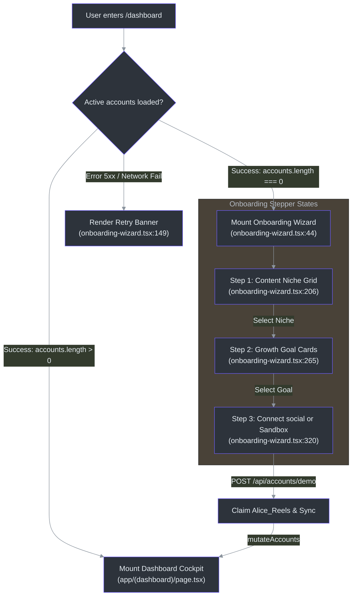

# Technical Specification: Trendoraa UI/UX Visual Architecture

This document provides a highly detailed, self-contained specification of the user interface (UI) and user experience (UX) architecture for **Trendoraa** (ReelMetrics / Reel Logic AI). It serves as a blueprint for verifying layout, style, and motion systems and is structured to allow another LLM to review the design decisions, evaluate performance constraints, and suggest optimization audits.

---

## 🎨 1. Global Visual Identity & Design Systems

Trendoraa follows an **Elite Clinical Analytics Engine** design philosophy. All layout constraints, typography weights, color balances, and animation curves are tuned to project scientific rigor, data accuracy, and modern technical aesthetics.

### 1.1 Color Tokens & HSL Mapping

Color tokens are optimized for high-contrast visibility on OLED displays. They are declared in `app/globals.css` and map to custom Tailwind CSS theme extensions:

| Token Key | HSL Color Coordinate | Hex Color | Design Application & Contrast Ratio | Source Reference |
| :--- | :--- | :--- | :--- | :--- |
| `--background` | `hsl(240, 25%, 3%)` | `#08090D` | Deep space obsidian base; absorbs light to focus attention on charts | [globals.css:43](file:///d:/Desktop/reel-logic-ai/app/globals.css#L43) |
| `--foreground` | `hsl(240, 10%, 97%)` | `#F8F8FC` | High-contrast off-white text; meets WCAG AA 7:1 contrast ratio | [globals.css:44](file:///d:/Desktop/reel-logic-ai/app/globals.css#L44) |
| `--primary` | `hsl(251, 88%, 62%)` | `#4F46E5` | Electric Cobalt; hyper-saturated indigo for primary actions | [globals.css:49](file:///d:/Desktop/reel-logic-ai/app/globals.css#L49) |
| `--secondary-foreground` | `hsl(158, 85%, 46%)` | `#14B8A6` | Neon Jade; bright mint green for positive metrics/growth indicators | [globals.css:52](file:///d:/Desktop/reel-logic-ai/app/globals.css#L52) |
| `--accent-foreground` | `hsl(328, 92%, 60%)` | `#F97316` | Sunset Rose/Signal Orange; marks warning thresholds and hook drops | [globals.css:56](file:///d:/Desktop/reel-logic-ai/app/globals.css#L56) |
| `--card` | `hsl(240, 10%, 6%)` | `#101114` | Solid card background; creates visual depth over obsidian | [globals.css:45](file:///d:/Desktop/reel-logic-ai/app/globals.css#L45) |
| `--border` | `hsl(225, 18%, 18%)` | `#252936` | Panel borders; defines clean divisions without visual noise | [globals.css:58](file:///d:/Desktop/reel-logic-ai/app/globals.css#L58) |
| `--input` | `hsl(225, 18%, 11%)` | `#171A21` | Dark, recessed text input background fields | [globals.css:59](file:///d:/Desktop/reel-logic-ai/app/globals.css#L59) |

### 1.2 Glassmorphism Surfaces

To give elements a floating visual weight, card panels apply a translucent backing layered over background blurs with thin border highlights:
* **Glass Panel (`.bg-glass`):** `background: rgba(16, 17, 20, 0.74); backdrop-filter: blur(12px); -webkit-backdrop-filter: blur(12px);` [(globals.css:134-138)](file:///d:/Desktop/reel-logic-ai/app/globals.css#L134-L138).
* **Glass Border (`.border-glass`):** `border: 1px solid rgba(255, 255, 255, 0.1);` [(globals.css:140-142)](file:///d:/Desktop/reel-logic-ai/app/globals.css#L140-L142).
* **Restrained Shadow (`.shadow-glow`):** `box-shadow: 0 18px 48px rgba(0, 0, 0, 0.22);` [(globals.css:144-146)](file:///d:/Desktop/reel-logic-ai/app/globals.css#L144-L146).

### 1.3 Typography Rules
* **Display Headers:** `font-family: var(--font-heading);` (resolving to *Outfit*, *Inter*, sans-serif). Configured with tight letter spacing (`letter-spacing: -0.025em`) to project modern trends [(globals.css:62, 128-131)](file:///d:/Desktop/reel-logic-ai/app/globals.css#L62#L128-L131).
* **Body Text & Controls:** `font-family: var(--font-sans);` (resolving to *Geist Sans*, *Inter*, sans-serif). Set at normal letter spacing for accessibility [(globals.css:61, 116-119)](file:///d:/Desktop/reel-logic-ai/app/globals.css#L61#L116-L119).
* **Metric Dials & Timelines:** Monospaced typography rules are applied directly to numerical strings to prevent horizontal layout shift during syncs and transitions.

---

## 🗺️ 2. Architectural System Layout & Routing Flow

Trendoraa coordinates layout switches dynamically based on database connection records. The diagram below illustrates how user sessions are evaluated to determine whether to present the Onboarding Stepper or render the populated Dashboard Cockpit:



---

## 🎛️ 3. State Machines & Ingestion Data Schemas

The onboarding experience operates as a strict state machine, preventing unfinished dashboard pages from loading until data ingestion succeeds or is bypassed via a sandbox demo.

### 3.1 Wizard State Transitions

The state machine is driven by three client state variables: `onboardingStep` (integer `1 | 2 | 3`), `niche` (string), and `goal` (string). They control the transition path:

| Current State | Event / User Action | Action Taken | Next State | Target Reference |
| :--- | :--- | :--- | :--- | :--- |
| **Step 1 (Niche Selection)** | User clicks niche button (e.g. `tech`) | Sets `niche = "tech"` parameter | **Step 2 (Goal Selection)** | [onboarding-wizard.tsx:54-57](file:///d:/Desktop/reel-logic-ai/components/dashboard/onboarding-wizard.tsx#L54-L57) |
| **Step 2 (Goal Selection)** | User clicks goal card (e.g. `retention`) | Sets `goal = "retention"` parameter | **Step 3 (Platform Link)** | [onboarding-wizard.tsx:59-62](file:///d:/Desktop/reel-logic-ai/components/dashboard/onboarding-wizard.tsx#L59-L62) |
| **Step 3 (Platform Link)** | User clicks `Back to Goal` | Clears `goal` state | **Step 2 (Goal Selection)** | [onboarding-wizard.tsx:426-432](file:///d:/Desktop/reel-logic-ai/components/dashboard/onboarding-wizard.tsx#L426-L432) |
| **Step 3 (Platform Link)** | User clicks `Explore Sandbox Demo` | Calls `triggerSandboxSeeding()` | **Sandbox Syncing** | [onboarding-wizard.tsx:64-101](file:///d:/Desktop/reel-logic-ai/components/dashboard/onboarding-wizard.tsx#L64-L101) |
| **Sandbox Syncing** | API seeding returns `success: true` | Calls `onComplete()` to mutate SWR | **Dashboard Active** | [onboarding-wizard.tsx:89-92](file:///d:/Desktop/reel-logic-ai/components/dashboard/onboarding-wizard.tsx#L89-L92) |
| **Sandbox Syncing** | API seeding returns `success: false` | Triggers error notification toast | **Seeding Error** | [onboarding-wizard.tsx:93-96](file:///d:/Desktop/reel-logic-ai/components/dashboard/onboarding-wizard.tsx#L93-L96) |

### 3.2 Ingestion Data Model Mapping
When onboarding successfully exits, data is stored in the database according to the following schema definitions:
* **Niche Variable (`instagram_accounts.niche`):** Persisted as string code mapping (e.g. `tech` | `comedy` | `finance` | `education` | `lifestyle` | `fashion`).
* **Goal Variable (`instagram_accounts.goal`):** Persisted as string code mapping (e.g. `retention` | `engagement` | `followers`).
* **Heuristic Fallback Indicator:** If an external LLM fails, `reel_scores.source` is marked as `"heuristic"` to identify computation source [(prd.md:257-260)](file:///d:/Desktop/reel-logic-ai/docs/prd.md#L257-L260).

---

## ⚡ 4. GPU-Accelerated Visual Motion & Canvas Mechanics

Trendoraa uses mathematical particle physics and 3D matrices rather than video elements to render background motion, conserving system resources and preventing rendering lag.

### 4.1 Custom WebGL Constellation backdrop (`strategy-matrix-3d.tsx`)

This component renders an interactive network constellation in an HTML5 canvas via Three.js. It does not load external visual assets, avoiding network requests during initial loads.

#### 4.1.1 Procedural Particle Generation
A custom glowing dot texture is generated programmatically on an offscreen canvas and loaded as a Three.js material:
```typescript
const createGlowingDot = () => {
  const canvas = document.createElement("canvas");
  canvas.width = 32;
  canvas.height = 32;
  const ctx = canvas.getContext("2d");
  if (ctx) {
    const gradient = ctx.createRadialGradient(16, 16, 0, 16, 16, 16);
    gradient.addColorStop(0, "rgba(255, 255, 255, 1)");
    gradient.addColorStop(0.3, "rgba(108, 92, 231, 0.8)"); // Brand Primary glow
    gradient.addColorStop(0.6, "rgba(0, 184, 148, 0.2)");  // Brand Secondary glow
    gradient.addColorStop(1, "rgba(0, 0, 0, 0)");
    ctx.fillStyle = gradient;
    ctx.fillRect(0, 0, 32, 32);
  }
  return new THREE.CanvasTexture(canvas);
}; // (strategy-matrix-3d.tsx:39-54)
```

#### 4.1.2 Optimization and Sleep Loops
* **Visibility Guard:** Checks `document.hidden` inside the RequestAnimationFrame (RAF) loop, suspending frame calculation when the browser tab is unfocused to save processor cycles:
  ```typescript
  if (document.hidden) {
    requestRef.current = requestAnimationFrame(animate);
    return; // Sleep frame calculation
  } // (strategy-matrix-3d.tsx:161-165)
  ```
* **Unmount Resource Disposal:** Standard garbage collection fails to clean WebGL context bindings, leading to GPU memory warnings. The unmount lifecycle hook cleans up all buffers:
  ```typescript
  pointsGeometry.dispose();
  pointsMaterial.dispose();
  dotTexture.dispose();
  lineGeometry.dispose();
  lineMaterial.dispose();
  renderer.dispose(); // (strategy-matrix-3d.tsx:293-298)
  ```

### 4.2 Niche-Driven Goal Particle Physics (`onboarding-core-3d.tsx`)

The particle orbit system adjusts its motion variables dynamically depending on the active onboard settings, reflecting selected goal metrics directly in the animation patterns:

```typescript
// Swirl speed, center gravity force, and canvas ribbon counts are configured per goal
let swirlSpeed = 1.0;
let centerGravity = 0.08;
let mouseGravity = 0.12;
let liquidComplexity = 3;

if (goal === "retention") {
  // Hypnotic concentric hold curve behavior
  swirlSpeed = 0.5;
  centerGravity = 0.15;
  liquidComplexity = 2;
} else if (goal === "engagement") {
  // Highly kinetic, rapid swirling vortex reacting to cursor movement
  swirlSpeed = 2.4;
  centerGravity = 0.05;
  mouseGravity = 0.22;
  liquidComplexity = 5;
} else if (goal === "followers") {
  // Expansive floating particle paths
  swirlSpeed = 0.8;
  centerGravity = 0.03;
  liquidComplexity = 4;
} // (onboarding-core-3d.tsx:98-114)
```

### 4.3 GPU-Accelerated Dashboard Background & React Compiler Optimizations (`DashboardBackground.tsx`)

To satisfy the strict static rendering rules of the React Compiler (Next.js 15+ / Next.js 16+), components utilising canvas simulations are structured to prevent render-phase side effects:
* **Global Buffer & Particle State Allocation:** Rather than using `useMemo` or `useRef` inside the component body, particle arrays (`PARTICLES_DATA`), velocity vectors (`VELOCITIES_DATA`), and pre-allocated `Float32Array` buffer attributes (`LINE_POSITIONS_BUFFER`, `LINE_COLORS_BUFFER`) are declared at the module scope level.
* **Deferred Initialization:** Initialization computations involving impure functions (`Math.random()`) and mesh manipulations are executed entirely within `useEffect` on mount. This ensures the component’s render function remains pure.
* **Zero-Allocation Rendering Loops:** Calculations inside `useFrame` directly read and write to these global buffers, preventing memory re-allocation, minimizing garbage collection sweeps, and maintaining a stable 60 FPS.
* **Mobile GPU Exits:** Mobile devices bypass WebGL canvas instantiation completely. If window pointer query matches `coarse` or browser width is below `768px`, the canvas is completely omitted from the DOM to preserve battery.

---

## 💻 5. Screen-by-Screen Layout & Copy Specs

Each interface screen is defined here with layout rules, metrics, interaction logic, and copy guidelines to ensure consistency.

### 5.1 Marketing Landing Page (`/`)
* **Layout Grid:** Asymmetric two-column header split (60% value copy, 40% interactive video scoring simulator widget).
* **Copy Tone:** High-status technical authority (e.g. *"Engineer Viral. Not Hope."*, *"Trendoraa evaluates retention triggers and pacing patterns, revealing exactly why your Reels capture the feed."*).
* **Metrics Ingestion Panel:**
  * Displays processing timeline: `Scan metadata` -> `Evaluate pacing` -> `Compare niche baseline`.
  * Renders overall score dial (0-100) next to the dual curve graph (Average curve in Sunset Rose vs. Trendoraa Optimized curve in Neon Jade).
* **Interaction Details:** Clicking primary buttons fires a micro-explosion of 8 diagonal gradient lines (`ClickSpark` effect) expanding outward from the click cursor coordinates.

### 5.2 Authentication Pages (`/login` & `/signup`)
* **Layout Grid:** 40% left panel (dark-indigo space detailing compute status and FAQ drawers), 60% right panel (clean centered glass credentials card).
* **Copy Tone:** Recalibrated to represent quota allocation (e.g. *"Access Computational Node / Establish Connection"* instead of Login, *"Establish Creator Vector / Secure Quota"* instead of Signup).
* **Credibility indicators:**
  * Real-time server health status bar: `Computational Node Status: Active | Active Slots: 88% | Latency: 92ms` [(prd.md:137)](file:///d:/Desktop/reel-logic-ai/docs/prd.md#L137).
  * Opportunity Cost warnings: *"Every daily posting cycle without algorithmic calibration represents a lost distribution window. Securing credentials locks in evaluation prioritization."* [(prd.md:133)](file:///d:/Desktop/reel-logic-ai/docs/prd.md#L133).

### 5.3 Onboarding Stepper Page (`/dashboard` - Initial State)
* **Layout Grid:** Responsive single-column stepper container. Transitions from niche card selector (6-grid button panel) to goal card selector (3-card vertical list), ending with the Social Connection and Sandbox Seeding panel.
* **Colors and Themes:** Clicking a niche card changes the background glow coordinates and highlights (e.g. `Tech` triggers Indigo `#6366F1`; `Comedy` triggers Rose `#F43F5E`; `Finance` triggers Amber/Jade gradient) [(onboarding-wizard.tsx:26-32)](file:///d:/Desktop/reel-logic-ai/components/dashboard/onboarding-wizard.tsx#L26-L32).
* **Sandbox Trigger:** In Step 3, the primary action button is a wide gradient block labeled *"Explore Sandbox Demo Account (3 Seconds)"*. It enqueues the simulated progress lines at 800ms intervals before Mutating accounts.

### 5.4 Dashboard Home (`/dashboard` - Active State)
* **Layout Grid:** Multi-row Bento panel layout.
  * *Row 1:* social profile status bar showing connected account avatar next to the Manual Sync button (which features a 5-minute countdown lock after clicking).
  * *Row 2:* Three stats cards (Followers, Reach, and Engagement Rate). An emerald-glowing `🎯 Goal Focus` badge overlay is applied to the card matching the target chosen during onboarding.
  * *Row 3:* Best Reel Spotlight card on the left (showing highest views, likes, shares, and skip rates), and Content Niche Calibrator summary on the right.
  * *Row 4:* Interactive Growth Matrix Heatmap (Viewer Attention Decay Curve).
* **Decay Curve Matrix:** Renders 15 second-by-second cells color-coded by watch percentages, with milestone nodes (H, B, E) mapped below. Clicking nodes scales them elastically (`scale: [1, 1.3, 1]`) and updates the suggestions drawer.

### 5.5 Social Accounts page (`/accounts`)
* **Layout Grid:** Three-column connection channel grid.
* **Component Chips:** Connected profiles feature a `SyncStatusChip` indicating exact state:
  * `active` / `completed` (Jade green)
  * `syncing` (Indigo pulse animation)
  * `rate_limited` (Amber; sync disabled)
  * `disconnected` / `error` (Red; requires re-authentication link) [(prd.md:223-225)](file:///d:/Desktop/reel-logic-ai/docs/prd.md#L223-L225).
* **Objection Resolution:** The empty state features an inline, step-by-step Meta Profile switch instruction drawer to address administrative requirements for Facebook Page linking.

### 5.6 Performance Analytics page (`/analytics`)
* **Layout Grid:** Two-column split layout.
  * *Column 1:* Follower history trend line and reach charts.
  * *Column 2:* Story completion list.
* **Visual Elements:**
  * SVG graphs draw their strokes on page load using progressive line-draw interpolation over 1.2s.
  * Hovering over data coordinates opens a floating glass details card that follows the cursor coordinate changes smoothly.
  * Active Story items map vertical progress bars representing completion rate: `stories.completion_rate = reach / impressions` [(prd.md:238)](file:///d:/Desktop/reel-logic-ai/docs/prd.md#L238).

### 5.7 Content Strategy page (`/strategy`)
* **Layout Grid:** Stacked full-width panels.
  * *Panel 1:* "What to Replicate" Winning Template panel, identifying shared hook triggers and average pacing cuts among top posts [(docs/screens-guide.md:339-346)](file:///d:/Desktop/reel-logic-ai/docs/screens-guide.md#L339-L346).
  * *Panel 2:* 3D Interactive Strategy Matrix showing priority bars for the 9 evaluation dimensions.
  * *Panel 3:* Trend Detection report switching between Niche gaps and Niche trends.
  * *Panel 4:* Persisted A/B Experiment queue panel.
* **A/B Experiment Queue Rules:**
  * Automatically enqueues concrete experiments for any dimension scoring below 5.0 across the last 5 posts.
  * Limit of 3 concurrent active experiments.
  * Completed and skipped items collapse into a historical timeline list stored in PostgreSQL.

### 5.8 Post Catalog List page (`/posts`)
* **Layout Grid:** 4-column responsive grid showcasing video cards.
* **Visual Badges:** Cards overlay the overall computed Engagement Moat rating (`overallScore` 1-100) next to views and likes counts.

### 5.9 Reel Detail page (`/posts/[id]`)
* **Unrated State:** Shows "AI Sparkles Portal" with a prominent primary button to "Execute AI Evaluation". Clicking it displays the terminal typewriter loading progress overlay.
* **Rated State:**
  * *Left Panel:* Ingested video player, raw description box, and engagement stats. Displays a prominent **Rewatch Rate** badge (`displayViews / reach`) with a Neon Jade label if the ratio $>1.4x$.
  * *Right Panel:* Circular score gauge (0-100), Floating Success Banner (`"This post is being rewatched — replicate its hook structure."` if rewatch rate $>1.4x$), second-by-second Attention Heatmap with the 2-Second Drop Detector warning flags, and the 9-Dimension score bars.
  * *Causal Hook Diagnosis Checklist:* Explains hook scores with 5 checks (Visual Motion, Text delay, Spoken word delay, Opener type, and Pronouns) compared to optimal parameters.

### 5.10 Billing page (`/billing`)
* **Layout Grid:** Four-tier pricing card grid (Free, Creator, Pro, Agency).
* **Objection Resolution:**
  * Display a secure payment badge next to Stripe checkmarks.
  * Display the Compute Routing SLA box: *"Computational resource routing is allocated on a rolling weekly basis to guarantee sub-second latency for live campaigns..."* [(prd.md:138)](file:///d:/Desktop/reel-logic-ai/docs/prd.md#L138).

### 5.11 User Settings page (`/settings`)
* **GDPR Portability:** Provides the "Export Personal Database" button. Triggering it compiles and downloads a JSON file containing all metrics from `instagram_accounts`, `reels`, `stories`, and `strategies` in under 5 seconds (excluding access keys) [(prd.md:295-300)](file:///d:/Desktop/reel-logic-ai/docs/prd.md#L295-L300).
* **GDPR Account Purge:** Provides the red "Delete account" button, executing a cascade delete across all connected media and user profiles [(prd.md:301-306)](file:///d:/Desktop/reel-logic-ai/docs/prd.md#L301-L306).

---

## 📏 6. Pixel-Perfect Layout, Alignment, & Spacing Specifications

To ensure exact replication of the layout system across platforms, all developers and styling engines must adhere to the following pixel-level margins, paddings, alignment parameters, and border specifications.

### 6.1 Layout Wrapper Spacing

The global dashboard Cockpit is governed by a responsive container system designed to prevent layout crowding:
* **Dashboard Cockpit Max Width:** Capped at `max-w-7xl` (`1280px`) on desktop, centered horizontally with `mx-auto`.
* **Standard Page Paddings:**
  * **Desktop ($>1024\text{px}$):** `px-8 py-6` ($32\text{px}$ horizontal, $24\text{px}$ vertical).
  * **Tablet ($768\text{px} - 1023\text{px}$):** `px-6 py-5` ($24\text{px}$ horizontal, $20\text{px}$ vertical).
  * **Mobile ($<768\text{px}$):** `px-4 py-4` ($16\text{px}$ horizontal, $16\text{px}$ vertical).
* **Standard Grid Gaps:**
  * Primary Bento Grids: `gap-6` ($24\text{px}$ grid gaps).
  * List items and filters: `gap-4` ($16\text{px}$ horizontal/vertical gaps).
  * Small actions inside elements: `gap-2` ($8\text{px}$ spacing).

### 6.2 Bento Card Surface Design (`.dashboard-card`)

Individual cards are styled with exact spacing and rounded corners:
* **Border Radius:**
  * Standard Bento Cards: `rounded-2xl` ($16\text{px}$ corner radius) [(globals.css:237)](file:///d:/Desktop/reel-logic-ai/app/globals.css#L237).
  * Nested badges and inputs: `rounded-xl` ($12\text{px}$ corner radius) [(globals.css:286)](file:///d:/Desktop/reel-logic-ai/app/globals.css#L286).
  * Small chips and status tags: `rounded-lg` ($8\text{px}$ corner radius) [(globals.css:300)](file:///d:/Desktop/reel-logic-ai/app/globals.css#L300).
* **Card Interior Paddings:**
  * Large statistics/heatmap wrappers: `p-5` ($20\text{px}$ padding) [(growth-matrix.tsx:236)](file:///d:/Desktop/reel-logic-ai/components/dashboard/growth-matrix.tsx#L236).
  * Mini charts and strategy widgets: `p-4` ($16\text{px}$ padding) [(growth-matrix.tsx:212)](file:///d:/Desktop/reel-logic-ai/components/dashboard/growth-matrix.tsx#L212).
* **Hover Transform Easing:** Translates upwards by exactly $1\text{px}$ (`translateY(-1px)`) over 200ms with ease-out interpolation (`transition: border-color 0.2s ease, box-shadow 0.2s ease, transform 0.2s ease;`) [(globals.css:239-245)](file:///d:/Desktop/reel-logic-ai/app/globals.css#L239-L245).

### 6.3 Layer Depth Hierarchy (Z-Indices)

To prevent visual collisions between interactive backdrops, absolute overlays, dialog boxes, and tooltips, the layout architecture follows a strict depth hierarchy:

| Depth Level | Layer Name | Z-Index | Design Elements | Implementation Reference |
| :--- | :--- | :--- | :--- | :--- |
| **0** | Base Page Wrapper | `z-0` | Space Obsidian background color | [globals.css:184](file:///d:/Desktop/reel-logic-ai/app/globals.css#L184) |
| **1** | Ambient Depth Hazes | `z-1` | Radial background gradients blur shapes | [globals.css:216](file:///d:/Desktop/reel-logic-ai/app/globals.css#L216) |
| **2** | WebGL Background Canvas | `z-2` / `default` | Strategy particle constellation canvas | [globals.css:234](file:///d:/Desktop/reel-logic-ai/app/globals.css#L234) |
| **10** | Dashboard Panel Elements | `z-10` | Interactive card grids, buttons, titles | [globals.css:234](file:///d:/Desktop/reel-logic-ai/app/globals.css#L234) |
| **20** | Timeline Warning Labels | `z-20` | Decay heatmap warning overlays | [growth-matrix.tsx:253](file:///d:/Desktop/reel-logic-ai/components/dashboard/growth-matrix.tsx#L253) |
| **30** | Interactive Curve Nodes | `z-30` | H, B, E button triggers on decay curve | [growth-matrix.tsx:321](file:///d:/Desktop/reel-logic-ai/components/dashboard/growth-matrix.tsx#L321) |
| **50** | Drop tooltips & Modals | `z-50` | Second-by-second metric hover details | [growth-matrix.tsx:309](file:///d:/Desktop/reel-logic-ai/components/dashboard/growth-matrix.tsx#L309) |

---

## 🛠️ 7. Validation Checklist for Reviewer LLMs

If you are an LLM verifying this visual and technical architecture, review the decisions against these specific criteria:

* **WCAG 2.2 AA Compliance Check:** Verify that body text elements (`--foreground` #F8F8FC) layered over card backgrounds (`--card` #101114) exceed the minimum contrast ratio of 4.5:1.
* **Tab Idle Performance:** Confirm that WebGL particle renders (`strategy-matrix-3d.tsx`) pause animation frame requests when `document.hidden` evaluates to `true`.
* **State Machine Loops:** Verify that the onboarding workflow prevents access to `/dashboard` cockpit subpages if `instagram_accounts.length === 0`, routing the session to the Stepper.
* **Heuristic Failures:** Ensure that if an API sync fails, the `OAuthErrorBanner` dismisses parameters and displays clean copy, and that the database enqueues backup data averages (`skipRate` at 50%, `engagementRate` at 2.0%) without throwing fatal exceptions.
* **Scrollbar Styling:** Confirm that global scrollbar rules use thin margins (`6px` width) and translucent overlays (`rgba(255, 255, 255, 0.1)`) to preserve OLED aesthetics.
* **React Compiler Compliance:** Ensure that render-phase functions do not access refs, mutate parent state synchronously, or call impure methods (such as `Date.now()`, `Math.random()`, or `window.location.hash` mutations). Check that initialization tasks are deferred to state initializers or `useEffect` hooks.

---

## 📚 8. References

References point to actual source paths and line numbers in the repository:
* **Base Variables & Glass Layouts:** [app/globals.css:21-40](file:///d:/Desktop/reel-logic-ai/app/globals.css#L21-L40), [app/globals.css:42-72](file:///d:/Desktop/reel-logic-ai/app/globals.css#L42-L72), [app/globals.css:134-143](file:///d:/Desktop/reel-logic-ai/app/globals.css#L134-L143)
* **Heatmap Array & 2-Second Drop Logic:** [components/dashboard/growth-matrix.tsx:49-75](file:///d:/Desktop/reel-logic-ai/components/dashboard/growth-matrix.tsx#L49-L75), [components/dashboard/growth-matrix.tsx:254-283](file:///d:/Desktop/reel-logic-ai/components/dashboard/growth-matrix.tsx#L254-L283)
* **Social OAuth Error Copy Mapping:** [components/dashboard/oauth-error-banner.tsx:19-82](file:///d:/Desktop/reel-logic-ai/components/dashboard/oauth-error-banner.tsx#L19-L82)
* **Callback Query Params Sanitizer:** [components/dashboard/oauth-error-banner.tsx:105-115](file:///d:/Desktop/reel-logic-ai/components/dashboard/oauth-error-banner.tsx#L105-L115)
* **Active Ingestion Log Typewriters:** [components/dashboard/anime-scoring-sequence.tsx:6-13](file:///d:/Desktop/reel-logic-ai/components/dashboard/anime-scoring-sequence.tsx#L6-L13)
* **Onboarding Particle palettes & Niche-driven speeds:** [components/dashboard/onboarding-core-3d.tsx:23-30](file:///d:/Desktop/reel-logic-ai/components/dashboard/onboarding-core-3d.tsx#L23-L30), [components/dashboard/onboarding-core-3d.tsx:93-114](file:///d:/Desktop/reel-logic-ai/components/dashboard/onboarding-core-3d.tsx#L93-L114)
* **Onboarding Steps Selections:** [components/dashboard/onboarding-wizard.tsx:26-34](file:///d:/Desktop/reel-logic-ai/components/dashboard/onboarding-wizard.tsx#L26-L34), [components/dashboard/onboarding-wizard.tsx:64-100](file:///d:/Desktop/reel-logic-ai/components/dashboard/onboarding-wizard.tsx#L64-L100)
* **Three.js Texture Program & Tab Sleep Guards:** [components/dashboard/strategy-matrix-3d.tsx:39-54](file:///d:/Desktop/reel-logic-ai/components/dashboard/strategy-matrix-3d.tsx#L39-L54), [components/dashboard/strategy-matrix-3d.tsx:157-165](file:///d:/Desktop/reel-logic-ai/components/dashboard/strategy-matrix-3d.tsx#L157-L165)
* **WebGL Context Memory Disposal:** [components/dashboard/strategy-matrix-3d.tsx:291-299](file:///d:/Desktop/reel-logic-ai/components/dashboard/strategy-matrix-3d.tsx#L291-L299)
